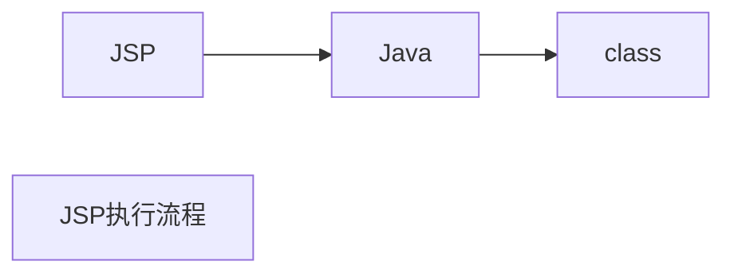

<!-- TOC -->

- [JSP执行流程](#jsp执行流程)
  - [第一次访问流程](#第一次访问流程)
  - [第二次访问](#第二次访问)
- [目录结构](#目录结构)
  - [WEB-INF](#web-inf)
- [JSP页面元素](#jsp页面元素)
- [JSP内置对象](#jsp内置对象)
  - [request](#request)
    - [示例](#示例)
  - [response](#response)
    - [登录示例](#登录示例)
    - [重定向与请求转发的区别](#重定向与请求转发的区别)
  - [session](#session)
    - [cookie](#cookie)
    - [session](#session-1)
  - [application](#application)
  - [四大范围对象](#四大范围对象)
- [JDBC](#jdbc)
  - [示例](#示例-1)
    - [MySQL](#mysql)
  - [Statement 与PreparedStatement的区别](#statement-与preparedstatement的区别)
  - [CLOB、BLOB](#clobblob)
- [Spring JDBC](#spring-jdbc)
- [MVC 设计模式](#mvc-设计模式)
  - [Servlet](#servlet)
    - [2.5版本的Servlet](#25版本的servlet)
    - [3.0版本的Servlet](#30版本的servlet)
    - [Servlet生命周期](#servlet生命周期)
  - [Servlet API](#servlet-api)
    - [类图](#类图)
- [三层架构](#三层架构)
  - [关系](#关系)
- [分页SQL](#分页sql)
  - [MySQL实现](#mysql实现)
- [上传和下载](#上传和下载)
  - [下载](#下载)
    - [response消息头](#response消息头)
- [EL（Expression Language）](#elexpression-language)
  - [EL示例](#el示例)
  - [EL中的隐式对象：](#el中的隐式对象)
- [JSTL](#jstl)
  - [通用标签库](#通用标签库)
    - [set](#set)
    - [out](#out)
  - [条件标签库](#条件标签库)
  - [迭代标签库](#迭代标签库)
- [过滤器](#过滤器)
- [监听器](#监听器)
- [Session的钝化与活化](#session的钝化与活化)
- [AJAX](#ajax)
  - [$.ajax](#ajax)
  - [$.get](#get)
  - [$.post](#post)
  - [$.load](#load)
  - [$.getJSON](#getjson)
- [连接池](#连接池)
  - [分类](#分类)
  - [DBCP](#dbcp)
  - [MySQL驱动](#mysql驱动)
- [集群](#集群)
  - [步骤](#步骤)
  - [IDEA创建项目Maven Web](#idea创建项目maven-web)
  - [EL表达式被当作字符串输出](#el表达式被当作字符串输出)

<!-- /TOC -->

# JSP执行流程

## 第一次访问流程



* JSP==>Java( Servlet文件)==>Class

*  Class保存位置：%APACHE_HOME%/work/Catalina/localhost/%PROJECT_NAME%/org/apache/jsp
* jsp与servlet文件可以相互转换
* 首次访问因需要翻译JSP，并编译为Class所以会比较慢

## 第二次访问

直接访问Class文件

* 如果服务端代码修改，需要重新翻译、编译JSP


# 目录结构

## WEB-INF

权限较高，客户端无法直接访问其中的文件，只能通过请求转发访问（代码访问）

注意：并不是任何跳转都能访问WEB-INF，

跳转：请求转发、重定向

# JSP页面元素

1. Scriptlet

i.

<%

​			局部变量、java语句

%>

ii.

<%!

​			全局变量、定义方法

%>

iii.

<%=

​			输出表达式（本质时变量，无需分号）

%>

out.println()并不能回车，分行，因为输出时html页面，需要回车需要输出" \<br/>",通过便签回车

2. 指令

page指令：

```jsp
<%@ page contentType="text/html;charset=UTF-8" language="java" import="java.util.Date"%>
```

3. 注释

* html注释 \<!-- -->
* java注释 // /*  \*/
* jsp注释<%-- --%>

# JSP内置对象

> 无需new，可直接使用，共9个

out

pageContext

## request

请求对象，存储“客户端向服务端发送的请求信息”

常见方法：

```java
//key-value
public String getParameter(String s);
//key-value 返回的value属性的内容，输入框是用户输入的内容
public String[] getParameterValues(String s);
//设置请求编码 不设置时使用Tomcat的默认编码，Tomcat7以前为iso-8859-1 8及以后为utf-8
public void setCharacterEncoding(String s) throws java.io.UnsupportedEncodingException
//请求转发
public javax.servlet.RequestDispatcher getRequestDispatcher(String s);
//获取项目的ServerletContext对象
public javax.servlet.ServletContext getServletContext();
```

* 统一请求（request）的编码(适用于get提交)

直接修改Tomcat server.xml  在``Connector``标签中添加属性 `URIEncoding="UTF-8"`

```xml
<Connector port="9999" protocol="HTTP/1.1" connectionTimeout="20000" redirectPort="8443" URIEncoding="UTF-8"/>
```
* 修改post提交的编码

```java
request.setCharacterEncoding("utf-8");
```

### 示例

> 注册

register.jsp

```jsp
<%--
  Created by IntelliJ IDEA.
  User: Administrator
  Date: 2020/6/15
  Time: 18:53
  To change this template use File | Settings | File Templates.
--%>
<%@ page contentType="text/html;charset=UTF-8" language="java" %>
<html>
<head>
    <title>注册</title>
</head>
<body>
<form action="show.jsp" method="get">
    <label>
        用户名：<input type="text" name="userName" placeholder="请输入用户名"/><br>
    </label>

    <label>
        密码：<input type="password" name="userPassword" placeholder="请输入密码"/><br>
    </label>

    <label>
        年龄：<input type="text" name="userAge"/><br>
    </label>

    <label>
        <input type="checkbox" name="userHobbies" value="basketball"/> 篮球 <br>
    </label>

    <label>
        <input type="checkbox" name="userHobbies" value="football"/> 足球 <br>
    </label>
    <input type="submit" value="注册">
</form>
</body>
</html>
```

show.jsp

``` jsp
<%--
  Created by IntelliJ IDEA.
  User: Administrator
  Date: 2020/6/15
  Time: 19:06
  To change this template use File | Settings | File Templates.
--%>
<%@ page contentType="text/html;charset=UTF-8" language="java" %>
<html>
<head>
    <title>注册结果</title>
</head>
<body>
    <%
        //设置post编码
        request.setCharacterEncoding("utf-8");
        String name = request.getParameter("userName");
        String password =request.getParameter("userPassword");
        int age = Integer.parseInt(request.getParameter("userAge"));
        String[] hobbies = request.getParameterValues("userHobbies");
    %>
    注册成功<br>
    姓名：<%=name%><br>
    年龄：<%=age%><br>
    密码：<%=password%><br>
    爱好: <br>

    <%
        if (hobbies != null) {
            for (String hobby : hobbies) {
                out.print(hobby+"<br>");
            }
        }
    %>
</body>
</html>

```

## response

> 服务器的响应对象

``` java
// 服务端向客户端发送cookie对象
public void addCookie(javax.servlet.http.Cookie cookie);
// 页面跳转的一种方式：重定向
public void sendRedirect(String s) throws java.io.IOException;
// 设置服务端响应编码（设置服务端content type类型）
public void setContetType(String type);
```

### 登录示例

login.jsp -> check.jsp->success.jsp

### 重定向与请求转发的区别

|                        | 请求转发        | 重定向          |
| ---------------------- | --------------- | --------------- |
| 地址栏是否改变         | 否（check.jsp） | 是(success.jsp) |
| 保留第一次请求时的数据 | 是              | 否              |
| 请求次数               | 1               | 2               |

请求转发：发生在服务端，客户端只请求一次，因此地址栏不改变

重定向：发生在客户端，一共发生两次请求、两次响应，因此改变地址栏

## session

* cookie（非内置对象）：存在于客户端，但由服务端产生，并发送给客户端保存

相当于缓存，但安全性较差，可以存储所有数据包括用户名、密码

* session：存在服务端


#### cookie

``` java
public Cookie(String name, String value);
String getName();
String getValue();
// 设置最大有效时间 单位为秒
public void setMaxAge(int expiry);
```
示例
> 使用IDEA直接在浏览器中打开JSP会出现额外的Cookie

```xml
<%@ page contentType="text/html;charset=UTF-8" %>
<html>
<head>
    <title>cookie</title>
</head>
<body>
    <%
        Cookie nameCookie = new Cookie("name", "汉化");
        Cookie pwdCookie = new Cookie("pwd", "123");

        response.addCookie(nameCookie);
        response.addCookie(pwdCookie);
        response.sendRedirect("result.jsp");
    %>
</body>
</html>
```
运行结果
```text
name->汉化
pwd->123
JSESSIONID->2056FA0AA10A5A7D83AF9D6B9FE82C2B
_ga->GA1.1.1407046998.1539679491
Phpstorm-3578c7dd->6e151674-32aa-45cf-afc8-df18bf90b15d
Webstorm-2f8f75da->aefea0b6-0075-49f7-802a-66218cb7a810
Idea-81a01b92->ddff9388-c05e-4245-af71-68974a8a50e7
Idea-8296e76f->8011e6d4-8bc4-4867-99fb-768eaf959354
```
#### session
客户端每次访问服务端时，服务端都会进行session与JSESSIONID的匹配，若匹配失败，证明是第一次访问，服务端会产生一个session对象，其中包含一个sessionId，此Id会被服务端添加到Cookie并发送给客户端（JSESSIONID），之后匹配成功后就无需产生新session对象，而可以直接进行匹配关联。

sessionid可以用来区分用户身份，类似于一些网站登陆过后的一段时间内都无需再次登录（淘宝、京东）。

1. session存储在服务端
2. session在同一个用户请求时共享
3. 服务端复制sessionId到cookie中的JSESSIONID中

**方法**
```java
// 获取sessionId
String getId();
// 是否是新用户
boolean isNew();
// 使sessi失效
void invalidate();

setAttribute();
getAttribute();
// 设置最大有效非活动时间   秒   非活动时间：用户停止操作的时间
public void setMaxInactiveInterval(int i);
public int getMaxInactiveInterval(int i);
```


## application


page

exception


## 四大范围对象

> 小->大

1. pageContext：当前页面有效，跳转后无效
2. request：同一次请求有效（重定向后无效）
3. session：同义词会话有效（通常关闭浏览器、切换浏览器后无效）
4. application：全局有效（关闭服务、其他项目无效）
5. 重启服务、多个项目共享可以使用JNDI实现

都具有setAttribute()|getAtribute();

* 使用时尽量使用范围最小的，因为范围越大开销越大

# JDBC

> java DataBase Connectivity 为多种关系型数据库提供统一的操作方式

* 驱动程序：各种数据库提供的操作数据库的程序

1. 功能

```java

DriverManager;管理驱动
Connection;连接
Statement(PreparedStatement);增删改查
CallableStatement;调用数据库的存储过程/存储函数
Result;返回的结果集
```

2. 使用JDBC的步骤

a. 导入驱动、加载具体的驱动类

b. 与数据库建立连接

c. 发送sql，执行

d. 处理结果集

3. 驱动程序

| 数据库     | 驱动                       | 具体驱动类                                   | 连接字符串                                       |
| ---------- | -------------------------- | -------------------------------------------- | ------------------------------------------------ |
| orcale     | ojdbc-x.jar                | oracle.jdbc.OracleDriver                     | jdbc:oracle:thin:@localhost:1521:ORCL            |
| Mysql      | mysql-connector-java-x.jar | com.mysql.jdbc.Driver                        | jdbc:mysql://localhost:3306/数据库实例名         |
| SQL Server | sqljdbc-x.jar              | com.microsoft.sqlserver.jdbc.SQLServerDriver | jdbc:microsoft:sqlserver:localhost:1433;database |


## 示例

### MySQL

```java
    public static void update() {
        Connection connection = null;
        PreparedStatement preparedStatement = null;
        try {
            Class.forName("com.mysql.jdbc.Driver");
            connection = DriverManager.getConnection(URL, USER_NAME, USER_PWD);

            String sql = "insert into student values(?, ?, ?, ?)";
            preparedStatement = connection.prepareStatement(sql);
            preparedStatement.setInt(1, 140);
            preparedStatement.setString(2, "yin");
            preparedStatement.setInt(3, 23);
            preparedStatement.setString(4, "wang luo");
            int count = preparedStatement.executeUpdate();
            if (count > 0) {
                System.out.println("操作成功");
            }
        } catch (ClassNotFoundException | SQLException e) {
            e.printStackTrace();
        } finally {
            try {
                if (preparedStatement != null) {
                    preparedStatement.close();
                }
                if (connection != null) {
                    connection.close();
                }
            } catch (SQLException throwables) {
                throwables.printStackTrace();
            }
        }
    }
```

## Statement 与PreparedStatement的区别

1. PreparedStatement性能更高（只预编译一次SQL）
2. PreparedStatement更加简便
3. PreparedStatement使用需要使用？充当占位符
4. PreparedStatement更安全：可以防止SQL注入

## CLOB、BLOB

> 不一定一定要存储大文本、大文件，可以选择存储文件路径的方法，读取时加一个IO操作即可

* clob：存储大文本数据。通过prepared.setCharacterStream()设置
* blob：存储二进制数据：通过setBinaryStream设置

# Spring JDBC

> spring框架对jdbc的简单封装，提供了一个JDBCTemplate对象简化JDBC的开发

* 导入jar包
* 创建``JDBCTemplate``对象（依赖于``DataSource``）
* 调用``JDBCTemplate``方法完成CRUD的操作


# MVC 设计模式

model(模型):一个功能

View（视图）:用于展示、与用户交互

Controller（控制器）:接受请求，将请求跳转到模型；模型处理完毕后，再将结果返回给请求处。一般使用servtet实现（也可以使用jsp实现）

## Servlet

1. 必须继承javax.servlet.http.HttpServlet
2. 必须重写doGet(),doPost():

### 2.5版本的Servlet


* 步骤

1. 继承HttpServlet
2. 重新doGet()、doPost（）
3. 编写web.xml中的映射（如上图）
4. eclipse可直接生成
5. 在<servlet>标签中使用<load-on-startup>可让对应servlet在tomcat启动时初始化，其中的1、2、3代表第几个servlet

### 3.0版本的Servlet

* 与2.5的区别：不需要编写web.xml中的配置，只需添加注解（再servlet类的实现处）:@WebServlet(name = "TestServlet")

在IDEA，直接右键：Create New Servlet即可

注意：

```jav
@WebServlet(name = "TestServlet", value = "/TestServlet", loadOnStartup = 1)
```

此注解中的起作用的（可通过超链接、form表单访问的url）字段是``value``，并且必须加 **/**

### Servlet生命周期


## Servlet API

组成：http协议软件包、非http协议软件包

参数：

servlet容器参数：

* 3.0版本：

```java
@WebServlet(name = "TestServlet", value = "/TestServlet", loadOnStartup = 1, initParams={@WebInitParam(name="ServletPara", value = "servlet")})
```

* 2.5版本：在web.xml中书写

```xml
    <servlet>
        <init-param>
            <param-name>namespace</param-name>
            <param-value></param-value>
        </init-param>
    </servlet>
```

servlet context参数（全局参数，所有servlet均可访问）

* 所有版本都只能在web.xml中配置（注解只能配置单个servlet）：

```xml
    <context-param>
        <param-name>global-version</param-name>
        <param-value>5.1.0</param-value>
    </context-param>
```

#### 类图


具体为：servlet提供``service``方法，子类httpService将其特化为专属于http协议的方法（doGet、doPost）

* 获取参数：

```java
		System.out.println("ServletPara: " + super.getInitParameter("ServletPara"));

// 		全局参数的获取需要首先获取 ServletContext对象
        System.out.println("Servlet 容器 全局参数：");
        ServletContext context = super.getServletContext();
        System.out.println("global: " + context.getInitParameter("global-version"));
```

# 三层架构

> 与MVC 设计模式目标一致，都是为了解耦合、提高代码复用率

* 表示层（USL，user show layer; 视图层）：前台界面，如：JSP

* 业务逻辑层(business logic layer;  Service)：可分割的事务操作

* 数据访问层(DAL, data acess layer;  Dao)：原子操作，不可分割

## 关系

上层将请求传给下层、下层处理后返回给上层

上层依赖于下层（持有下层的对象）


#  分页SQL

> 必须知道每一页数据的开始与结束位置

若每一页显示10条数据：

第n页：

开始：n * 10 - 9			 结束：n * 10

## MySQL实现

> mysql从0 开始拘束，oracle与SQLServer是1开始计数

第n页：

开始：n * 10 			 结束：n * 10 + 9


SQL语句

* limit

```sql
-- 第0页
select * from student limit 0,10;
-- 第n页
select * from student limit n * 10,10;
-- select * from student limit n * 页面大小, 页面大小;

--Oracle
--1.rownum顺序被打乱
select rownum, t.* from student t where sno >= (n - 1) * 10  + 1 and sno <=n*10 order by sno ;
--2.rownum只能查询<的数据，不能拆线呢大于的数据（特性）

--1.解决：分开语句
--select s.* from student s order by sno asc;
select rownum, t.* from (select s.* from student s order by sno asc) t;
--2.解决:再次分开看做一张表
select * from (
	select rownum r, t.* from (select s.* from student s order by sno asc) t;
) where r >=(n-1)*10+1 and r <= n * 10;
--3.优化
select * from (
	select rownum r, t.* from (select s.* from student s order by sno asc) t
    where r <= n * 10
) where r >=(n-1)*10+1;

--SQLServer 2005后支持
--SQLServer的rownum 中叫做row_number()
select * from (
	select row_number() over(sno order by sno asc) as r, * from student
    where r <= n * 10
) where r >=(n-1)*10+1;
--与Oracle分页的区别
1.rownum(oracle), sqlserver row_number();
2.oracel需要子查询排序，sqlserver不需要

```

# 上传和下载


## 下载

> 下载无须借助任何jar包，但需要设置``response``的消息头

### response消息头


```java
//1.MIME
response.addHeader("contentType", "MIME类型(上图)");
response.addHeader("content-Disposition", "attachment;filename=" + filename);

//2.解决中文文件名乱码问题
// 火狐
response.addHeader("content-Disposition", "attachment;filename==?UTF-8?B?" + new String(Base64.encode(fileName.getBytes(StandardCharsets.UTF_8))) + "?=");

//其他
response.addHeader("content-Disposition", "attachment;filename=" + URLEncoder.encode(fileName, "UTF-8"));

```

# EL（Expression Language）

> 可以替代jsp中的java语言
>
> EL表达式中可以不写作用域，因为EL会从小到大寻找，但建议写上作用域i

在jsp中使用java的弊端

1. 麻烦
2. 类型转换
3. 不好处理null值

## EL示例

```jsp
${requestScope.page.currentPage}
${域对象.属性名字.属性的属性.(级联)}

// 操作符
// 1. 点操作符 .
${requestScope.page.currentPage}
// 2. 中括号操作符[""]或者['']
${requestScope.page["currentPage"]}
```

操作符利弊：

1. 点操作符使用简便
2. 中括号更强大
   1. 可以包含特殊字符：{、- .}
   2. 可以使用变量 ，如name是一个String变量 则``${requestScope[name]}`（不加引号时变量）
   3. 可以获取数组元素：``${requestScope.page[0]}``
3. 获取map属性
4. 关系运算符、逻辑运算符
5. Empty运算符：null或不存在为true


## EL中的隐式对象：

1. 作用域对象
   1. pageScope、requestScope、sessionScope、applicationScope
2. 参数访问对象：获取表单数据（request.getParameter()）
   * ${param}
3. JSP隐式对象
   * ${pageContext.request.servletPort}
   * 可以级联获取
   * ${pageContext.方法名去掉（）并且首字母小写}

# JSTL

> 比EL更加强大

1. 依赖

需要两个jar包：

* jstl.jar
* standard.jar

maven项目可以直接添加依赖后可直接使用（否则IDEA无法识别JSTL）:

```xml
    <dependency>
      <groupId>taglibs</groupId>
      <artifactId>standard</artifactId>
      <version>1.1.2</version>
    </dependency>

    <dependency>
      <groupId>jstl</groupId>
      <artifactId>jstl</artifactId>
      <version>1.2</version>
    </dependency>
```

2. 使用

```jsp
<%@ taglib prefix="jstl" uri="http://java.sun.com/jsp/jstl/core" %>
<--prefix:作用域前缀-->
```

3. 核心标签库
   1. 通用标签库
   2. 条件标签库
   3. 迭代标签库

## 通用标签库

### set

```jsp
// 1.赋值（需要指定域：scope，即四个范围对象）
// 等价于：<% request.setAttribute("student", "yin") %>
<jstl:set var="student" value="yin" scope="request" />
```

2. 在某个作用域中给某个对象属性赋值
   1. 普通对象

```jsp
<jstl:set target="${requestScope.student}" property="name" value="jia" />
```

* 此种写法不能用``scope``属性

  2. map对象

  ```jsp
  Map<String, Object> map = new HashMap<>();
  map.put("yin", 1);
  map.put("cn", "china");
  request.setAttribute("mapKey", map);

  <jstl:set target="${requestScope.mapKey}" property="yin" value="5" />
  ```

3. 可以给不存在的属性赋值（不可以给不存在的对象的属性赋值）

### out

> 显示值

```jsp
<jstl:out value="${requestScope.student.home}" default="不存在！" />
```

* 可以给空值设置默认值

## 条件标签库

```jsp
<jstl:if test="${5 lt 1}">
    5大于1
</jstl:if>

// var属性
<jstl:if test="${5 gt 1}" var="result">
    5大于1
    ${result}
</jstl:if>
// 存放test运算的结果值

<jstl:set var="role" value="teaher" scope="page" />
<jstl:choose>
    <jstl:when test="${pageScope.role == 'teacher'}">
        老师<br>
    </jstl:when>
    <jstl:when test="${pageScope.role == 'student'}">
        学生<br>
    </jstl:when>
    <jstl:otherwise>
        所有其他人员<br>
    </jstl:otherwise>
</jstl:choose>
```

重点：

* ``test``属性中严格区分空格，多出任何一个空格都会导致条件判断出错

## 迭代标签库

1. for

```jsp
<jstl:forEach begin="5" end="10" step="2" varStatus="status">
    <br>${status.index}
    <br>${status.step}
    <br>${status.begin}
    <br>${status.end}
    <br>${status.current}
    <br>---------------------------
</jstl:forEach>
```

2. foreach

```java
Object[] items = {1, "hhhh", new LinkedList<>()};
request.setAttribute("items", items);
```

```jsp
<jstl:forEach var="item" items="${requestScope.items}">
    <br>${item}
</jstl:forEach>
```


# 过滤器

> 过滤器会拦截指定的请求（request），与响应，除非主动放行

* 使用

new -》create new filter

```java
// /*会拦截所有请求
@WebFilter(filterName = "TestFilter", value = "/*")
public class TestFilter implements Filter {
    @Override
    public void destroy() {
        System.out.println("TestFilter.destroy");
    }

    @Override
    public void doFilter(ServletRequest req, ServletResponse resp, FilterChain chain) throws ServletException, IOException {
        System.out.println("拦截请求");

        if (req instanceof HttpServletRequest) {
            HttpServletRequest httpServletRequest = (HttpServletRequest) req;
            System.out.println(httpServletRequest.getRequestURL());
        }
        chain.doFilter(req, resp);
        System.out.println("拦截响应");
    }

    @Override
    public void init(FilterConfig config) throws ServletException {
        System.out.println("TestFilter.init");
    }
}

// 输出结果

拦截请求
http://localhost:9999/JspExpandDemo_war_exploded/InitServlet
拦截响应
拦截请求
http://localhost:9999/JspExpandDemo_war_exploded/for.jsp
拦截响应
```


# 监听器

> 可以监听除``pageContext``对象的三大对象的初始化、销毁、属性值添加、移除、替换等事件

示例：

```java
@WebListener()
public class RequestListener implements ServletRequestListener, ServletRequestAttributeListener {
    @Override
    public void requestDestroyed(ServletRequestEvent servletRequestEvent) {
        System.out.println("RequestListener.requestDestroyed");
    }

    @Override
    public void requestInitialized(ServletRequestEvent servletRequestEvent) {
        System.out.println("RequestListener.requestInitialized");
    }

    @Override
    public void attributeAdded(ServletRequestAttributeEvent servletRequestAttributeEvent) {
        System.out.println("RequestListener.attributeAdded");
        System.out.println("添加的属性名 = " + servletRequestAttributeEvent.getName());
        System.out.println("添加的属性值 = " + servletRequestAttributeEvent.getValue());
    }

    @Override
    public void attributeRemoved(ServletRequestAttributeEvent servletRequestAttributeEvent) {
        System.out.println("RequestListener.attributeRemoved");
        System.out.println("移除的属性名 = " + servletRequestAttributeEvent.getName());
        System.out.println("移除的属性值 = " + servletRequestAttributeEvent.getValue());
    }

    @Override
    public void attributeReplaced(ServletRequestAttributeEvent servletRequestAttributeEvent) {
        System.out.println("RequestListener.attributeReplaced");
        System.out.println("替换的属性名 = " + servletRequestAttributeEvent.getValue());
        System.out.println("替换的属性值 = " + servletRequestAttributeEvent.getName());
    }
}
```

jsp页面：

```jsp
<%@ page import="org.example.entity.Student" %>
<%@ taglib prefix="jstl" uri="http://java.sun.com/jsp/jstl/core" %>
<%@ page isELIgnored="false" %>
<%@ page contentType="text/html;charset=UTF-8" language="java" %>
<html>
<head>
    <title>JSTL测试</title>
</head>
<body>
<h2>Hello World!</h2>
<%
    Student student = new Student(5, "lis", "us");
    request.setAttribute("student", student);
%>

<jstl:set var="name" value="yin" scope="request"/>
<p>set 后显示：</p><br>
<%--<jstl:out value="student" />--%>
${requestScope.student}<br>
${requestScope.student.id}<br>
${requestScope.student.name}<br>
${requestScope.student.address}<br>

<jstl:set target="${requestScope.student}" property="name" value="jia"/>
${requestScope.student.name}<br>

=======c:out=========<br>
<jstl:out value="${requestScope.student.home}" default="不存在！"/>

<jstl:out value="<a href='https://www.baidu.com'>百度</a>" escapeXml="false"/>

=======c:reomve=========<br>
<jstl:set var="temp" value="test" scope="request"/>
${requestScope.temp}
<jstl:remove var="temp" scope="request"/>
<jstl:out value="${requestScope.temp}" default="已经移除"/>
</body>
</html>
```

运行结果;

```java
RequestListener.requestInitialized
RequestListener.attributeReplaced
替换的属性名 = true
替换的属性值 = org.apache.catalina.ASYNC_SUPPORTED
拦截请求
http://localhost:9999/JspExpandDemo_war_exploded/
RequestListener.attributeAdded
添加的属性名 = student
添加的属性值 = org.example.entity.Student@628dce3
RequestListener.attributeAdded
添加的属性名 = name
添加的属性值 = yin
RequestListener.attributeAdded
添加的属性名 = temp
添加的属性值 = test
RequestListener.attributeRemoved
移除的属性名 = temp
移除的属性值 = test
拦截响应
RequestListener.requestDestroyed
```


# Session的钝化与活化

钝化：内存==》硬盘

活化：硬盘==》内存


session 的四种状态：

1. 对象绑定到session
2. 对象从session解绑
3. 钝化
4. 活化

绑定与解绑使用``httpSessionAttributeListener``监听

钝化、活化使用``HttpSessionActivationListener``监听


# AJAX

> Asynchronous Javascript And XML

传统javascript较麻烦，主要是需要设置请求消息头，比较难记、麻烦，一般直接使用JQuery帮助实现AJAX

## $.ajax

```js
$.ajax(
    {
        url: "AjaxServlet",
        type: "post",
        data: "welcome: hello world",
        success:function (data, textStatus, jqXHR) {
            console.log(data);
            console.log(textStatus);
            console.log();
            if (data === "true") {
                alert("注册成功！")
            } else {
                alert("注册失败！")
            }
        },
        error: function (jqXHR, textStatus, errorThrown) {
            alert("服务器异常！")
            console.log(jqXHR);
            console.log(textStatus);
            console.log(errorThrown);
        }
    }
)
```

## $.get

```js
$.get(
	//服务器地址
    //请求数据
    //只有success
    function(data, textStatus, jqXHR) {

    }
)
```

## $.post

```js
$.post(
	//服务器地址
    //请求数据
    //只有success
    function(data, textStatus, jqXHR) {

    },
    //预期返回值类型(string/xml)
)
```

## $.load

```js
$("#server").load(
    "AjaxServlet",
    "welcome=hello world"
)
```

## $.getJSON

```js
$.getJSON(
    "AjaxServlet",
    {"welcome": "hello world"},
    function (data, textStatus, jqXHR) {
        if (data === "true") {
            alert("注册成功！")
        } else {
            alert("注册失败！")
        }
    }
)
```


# 连接池

> 数据库的连接打开和关闭比较耗费性能，如果每个用户连接都进行一次打开和关闭会严重影响服务器性能，因此连接池可以用于解决此问题。
>
> 连接池中有指定数量的活动连接，如果当前有活动链接，访问数据库就不再需要重新建立连接。


## 分类

1. DBCP

2. c3p0

3. druid：阿里巴巴提供的（性能最好?）

   

## DBCP

apache-commons-dbcp

```xml
<dependency>
  <groupId>org.apache.commons</groupId>
  <artifactId>commons-dbcp2</artifactId>
  <version>2.7.0</version>
</dependency>

<dependency>
  <groupId>mysql</groupId>
  <artifactId>mysql-connector-java</artifactId>
  <version>8.0.20</version>
</dependency>
```

* 属性文件：

```properties
driverClassName=com.mysql.cj.jdbc.Driver
url=jdbc:mysql://localhost:3306/test_db
username=root
password=2213662140love
initialSize=20
```

* 建立连接

```java
public static DataSource getDhcp() throws Exception {
    if (!(dataSource instanceof BasicDataSource)) {
        Properties properties = new Properties();
        properties.load(DataSourceUtils.class.getResourceAsStream("/apache_dbcp_config.properties"));
        dataSource = BasicDataSourceFactory.createDataSource(properties);
    }

    return dataSource;
}
```

## MySQL驱动

新版mysql的驱动类已经改变位置了``com.mysql.cj.jdbc.Driver``.


# 集群

1.分类

* Apache（这里的apache指的是apache服务器，而不是基金会）
* nginx

## 步骤

1. 下载apache服务器：httpd.apache.org

2. 修改conf/httpd.conf 中的 ``SRVROOT``为apache服务器所在目录

   Define SRVROOT "D:\cluster\Apache24"

3. 复制两个tomcat服务器目录到apache服务器目录下

4. 分别修改两个tomcat服务器的端口号：server端口、http端口、ajp端口

5. 删除CATALINA_HOME环境变量，此变量会使得start.bat每次都执行此环境变量所指的tomcat服务器

6. 整合apache与tomcat，下载``mod_jk.so``

   http://archive.apache.org/dist/tomcat/tomcat-connectors/jk/binaries/windows/tomcat-connectors-1.2.40-windows-x86_64-httpd-2.4.x.zip

7. 解压缩后放到``modules``目录，并创建workers.properties文件

   ```properties
   worker.list=controller,tomcata,tomcatb
   #tomcata
   worker.tomcata.port=1009
   worker.tomcata.host=localhost
   worker.tomcata.type=ajp13
   #负载均衡的权重
   worker.tomcata.lbfactor=1

   #tomcatb
   worker.tomcatb.port=2009
   worker.tomcatb.host=localhost
   worker.tomcatb.type=ajp13
   #负载均衡的权重
   worker.tomcatb.lbfactor=2

   #controller
   #lb=load balancing
   worker.controller.type=lb
   worker.controller.blacnced_workers=tomcata,tomcatb
   worker.controller.sticky_session=false
   ```

8. 创建并配置mod_jk.conf

   ```conf
   #加载mod_jk.so文件
   LoadModule jk_module modules/mod_jk.so
   #加载worker.properties文件
   JkWorkersFile conf/workers.properties
   #表示拦截一切请求
   JkMount /* controller
   ```

9. 配置``conf/httpd.conf``

   追加：``include conf/mod_jk.conf``

10. 在tomcata、tomcatb中添加同样的一个项目

11. **http://localhost/ClusterPro/index.jsp**即可访问

## 重点

1. Tomcat9.0.31配置AJP连接有改变

```xml
<Connector protocol="AJP/1.3" address="::1" port="5999" redirectPort="8443" secretRequired="" />
```

2. 删除``address``

```xml
<Connector protocol="AJP/1.3" port="5999" redirectPort="8443" secretRequired="" />
```

应该是因为``workers.properties``与``Connector``标签的地址值不统一，因此修改为``address="localhost"``也可

3. session

```xml
sessionId:
665DD54AD9624CE5FDF502CE5A159B13.tomcat9b
```

通过jsp页面输出sessionId，可以发现，sessionId后附加了一个字符串，此字符串是``Engine``标签中的``jvmRoute``属性指定的

```xml
<Engine name="Catalina" defaultHost="localhost" jvmRoute="tomcat9b">
```


# 相关问题


1. Tomcat输出乱码

> Windows系统的cmd是GBK编码的，所以IDEA的下方log输出的部分的编码也是GBK的，然而Tomcat 9.0 版本默认log输出是UTF-8编码的，采用了两种不同的编码方式就会导致乱码。

* 修改 **logging.properties** 文件中的所有UTF-8为GBK
* 修改IDEAsetting中的 File Encoding中的所有未UTF-8
* 添加IDEA启动配置参数：-Dfile.encoding=UTF-8（IDEA安装目录下的bin中的iidea.exe.vmoptions和idea64.exe.vmoptions两个文件）
* 添加Tomcat的VM启动参数：-Dfile.encoding=UTF-8

2. 何时重启Tomcat

一般而言：修改java、web.xml、配置文件，需要重启

修改jsp、html、css、js不需要重启

## IDEA创建项目Maven Web

* 选择原型apache.webapp
* 添加javaee的依赖

```xml
    <dependency>
      <groupId>javax</groupId>
      <artifactId>javaee-api</artifactId>
      <version>8.0</version>
    </dependency>
```

## EL表达式被当作字符串输出

解决办法：

```jsp
<%@ page isELIgnored="false" %>
```
