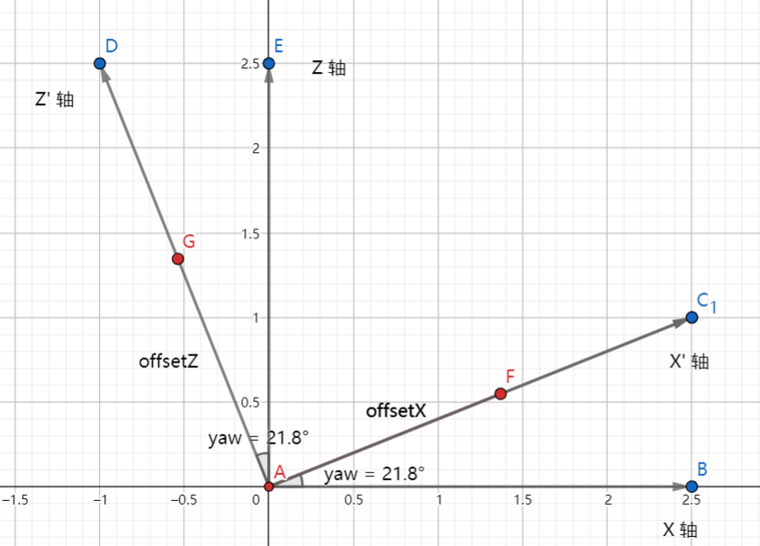

= Camera

避免使用 `lookAt`footnote:[参考 JoeyDeVries https://learnopengl.com/#!Getting-started/Camera[Camera]] 方法可以减少计算 `ViewMatrix` 的复杂性

直接修改 `ViewMatrix` 会更加简单，但是需要一定的数学计算footnote:[参考 link:++https://lwjglgamedev.gitbooks.io/3d-game-development-with-lwjgl/content/chapter08/chapter8.html++[
3D Game Development with LWJGL 3#Camera]]：

下面是一个不能自由飞行的 `Camera` 实现，也就是被限制在 `X-Z` 平面上
[source,java]
.Camera.java
----
/**
 * 相机类， 默认上向量为 y 轴 正方向.
 *
 * @author fkrobin
 * @date 2022/2/27
 */
public class Camera {
  private final Matrix4f viewMatrix;

  private final Vector3f position;
  private final Vector3f rotation;

  private float speed;
  private float rotateSensitivity;

  /**
   * 默认位置为世界原点，目标方向为 Z 轴负方向.
   */
  public Camera() {
    this(new Vector3f());
  }

  /**
   * 指定摄像机的初始位置，目标方向为 Z 轴负方向.
   *
   * @param position 摄像机的初始位置.
   */
  public Camera(Vector3f position) {
    this(position, new Vector3f());
  }

  /**
   * 指定摄像机的初始位置和视线方向.
   *
   * @param position 摄像机的初始位置
   * @param rotation 摄像机的初始旋转
   */
  public Camera(Vector3f position, Vector3f rotation) {
    this.position = position;
    this.rotation = rotation;

    this.viewMatrix = new Matrix4f();

    this.speed = 1;
    this.rotateSensitivity = 0.05f;
  }

  //////////////////////////////////////////////////
  // Setter and getter
  //////////////////////////////////////////////////

  /**
   * 根据摄像机视线方向、旋转角度，位置计算视图矩阵,.
   *
   * @return 当前的 View matrix
   */
  public Matrix4f getViewMatrix() {
    viewMatrix.identity();
    // First do the rotation so camera rotates over its position
    viewMatrix.rotate(toRadians(rotation.x), new Vector3f(1, 0, 0))
              .rotate(toRadians(rotation.y), new Vector3f(0, 1, 0));
    // Then do the translation
    viewMatrix.translate(-position.x, -position.y, -position.z);
    return viewMatrix;
  }

  //////////////////////////////////////////////////
  // Function method
  //////////////////////////////////////////////////

  /**
   * 将摄像机在其自身坐标内位移一定距离.
   *
   * @param offsetX (摄像机坐标系)X 轴方向的位移距离
   * @param offsetY (摄像机坐标系)Y 轴方向的位移距离
   * @param offsetZ (摄像机坐标系)Z 轴方向的位移距离
   */
  public void move(float offsetX, float offsetY, float offsetZ) {
    if (offsetZ != 0) {
      position.x += sin(toRadians(rotation.y)) * -1.0f * offsetZ;
      position.z += cos(toRadians(rotation.y)) * offsetZ;
    }
    if (offsetX != 0) {
      position.x += cos(toRadians(rotation.y)) * offsetX;
      position.z += sin(toRadians(rotation.y)) * offsetX;
    }

    position.y += offsetY;
  }

  public void forward() {
    move(0, 0, -step());
  }

  public void backward() {
    move(0, 0, step());
  }

  public void toLeft() {
    move(-step(), 0, 0);
  }

  public void toRight() {
    move(step(), 0, 0);
  }

  private float step() {
    return speed;
  }

  public void rotate(double pitch, double yaw) {
    rotate((float) pitch, (float) yaw);
  }

  /**
   * 根据俯仰和偏好角度更新 target 向量.
   *
   * @param pitch 俯仰角度
   * @param yaw   偏航角度
   */
  public void rotate(float pitch, float yaw) {
    rotation.x += pitch * rotateSensitivity;
    rotation.y += yaw * rotateSensitivity;

    if (rotation.x > 89.0f) {
      rotation.x = 89.0f;
    }
    if (rotation.x < -89.0f) {
      rotation.x = -89.0f;
    }
  }
}
----