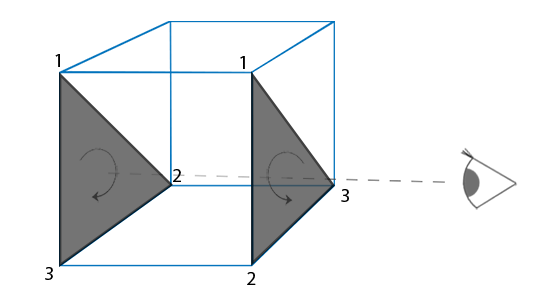

= CullFace

对于一个正方体来说，你在任何时候都只能看见其最多三个面，因此另外三个面实际上是不需要渲染的。只对封闭图形有意义。

`OpenGL` 通过顶点的环绕方向判断一个面是否是正面，而且环绕顺序的判断是在光栅化阶段进行的，也就是顶点着色器之后。这时的点点就是在**观察者空间**的了:

但这并不是任何时候都有必要：

. 地板就不应该使用 `CullFace`
. 草这种非封闭的图形也不应该使用 `CullFace`

== 使用

启用：

[source,java]
----
glEnable(GL_CULL_FACE);
----

指定剔除的面：
[source,java]
----
glCullFace(GL_FRONT);
----
可选值::
* `GL_BACK`：只剔除背向面。
* `GL_FRONT`：只剔除正向面。
* `GL_FRONT_AND_BACK`：剔除正向面和背向面。

定义正面的环绕方向：

[source,java]
----
glFrontFace(GL_CCW); // <1>
----
<1> 定义顺时针的环绕方向是正面

