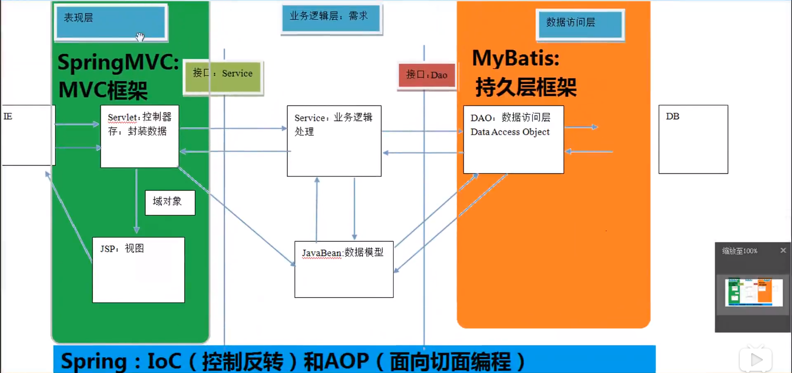

<!-- TOC -->

- [框架](#框架)
  - [什么是框架Markdown Writer: Create Default keymaps](#什么是框架markdown-writer-create-default-keymaps)
  - [MyBatis](#mybatis)
    - [流程](#流程)
  - [Mybatis的CURD](#mybatis的curd)
- [Resources源码分析](#resources源码分析)

<!-- /TOC -->

# 框架

## 什么是框架

框架( Framework)是整个或部分系统的可重用设计,表现为一组抽象构件及构件实例间交互的方法;另一种定义认为,框架是可被应用开发者定制的应用骨架。前者是从应用方面而后者是从目的方面给出的定义。

简而言之,框架其实就是某种应用的半成品,就是一组组件,供你选用完成你自己的系统。简单说就是使用别人搭好的舞台,你来做表演。而且,框架一般是成熟的,不断升级的软件。

三层架构
1. 表现层：展示数据
2. 业务层：处理业务需求
3. 持久层：与数据库交互



持久层解决方案：
1. JDBC
    * Connection
    * PreparedStatement
    * ResultSet
2. JDBCTemplate
    * Spring对JDBC的简单封装
3. DBUtils
    * Apache的对JDBC的简单封装
以上这些都不是框架JDBC是规范;Spring的 Jdbctemplate和 Apache的 DBUTI1s都只是工具类

即使对JDBC进行了简单的封装，持久层操作依然麻烦、容易出错

## MyBatis

mybatis是一个优秀的基于java的持久层框架,它内部封装了jdbc,使开发者只需要关注sq이语句本身,而不需要花费精力去处理加载驱动、创建连接、创建 statement等繁杂的过程。

mybatis通过Xm或注解的方式将要行的各种 statement配置起来,并通过java对象和 statement中se的动态参数进行映射生成最终执行的SQL语句,最后由 mybatis框架执行sq并将结果映射为java对象并返回。

采用ORM思想解决了实体和数据库映射的问题,对jdb进行了封装,屏蔽了 jdbc api底层访问细节,使我们不用与 jdbc api打交道,就可以完成对数据库的持久化操作

**ORM** (Object Relational Mapping) 对象关系映射。就是把数据库表和实体类及实体类的属性对应起来让我们可以操作实体类就实现操作数据库表。因此也需要保证实体类与数据库表的属性一致

MyBatis环境搭建注意事项：
1. 创建 ``Iuserdao.xml`` 和 ``Iuserdao.java`` 时名称是为了和我们之前的知识保持一致在 Mybatis中它把持久层的操作接口名称和映射文件也叫做: Mapper所以: ``Iuserdao`` 和 ``Iusermapper`` 是一样的
2. 在idea中创建目录的时候,它和包是不一样的包在创建时:``com. itheima.dao`` 它是三级结构目录在创建时: ``com.itheima.dao`` 是一级目录
3. matis的映射配置文件位置必须和dao接口的包结构相同
4. 映射配置文件的 mapper标签 namespace属性的取值必须是dao接口的 **全限定类名**
5. 映射配置文件的操作配置(select),id属性的取值必须是dao接口的方法名

好处: 当我们遵从了第三,四,五点之后,我们在开发中就无须再写dao的实现

使用步骤:
1. 读取配置文件
2. 创建 ``Salsessionfactory`` 工厂
3. 创建 ``Sqlsession``
4. 创建Dao接口的代理对象
5. 执行dao中的方法
6. 释放资源
* 注意事项不要忘记在映射配置中告知 ``Mabatis`` 要封装到哪个实体类中配置的方式:指定实体类的全限定类名

注解配置：

```java
public interface IUserDao {
    @Select("select * from user")
    List<User> findAll();
}
```
* 注解配置需要在``mapper``中指定使用注解的全限定类名
```java
<mappers>
  <mapper class="org.example.dao.IUserDao" />
</mappers>
```

**Sqlsession** 的作用
1. 生成接口代理对象
2. 定义通用增删改查的方法


# Mybatis的CURD

1. add

```java
@Insert("insert into user(username,birthday,sex,address) values(#{username},#{birthday},#{sex},#{address})")
void addUser(User user);
```


```java
    @After
    public void destroy() throws Exception {
        // Mybatis默认关闭自动提交事务，需要手动提交
        sqlSession.commit();
        sqlSession.close();
        inputStream.close();
    }
```

2. update
3. delete: 只需要传入一个Integer，此时sql语句中的参数只需要写入一个占位符，无论叫什么名字都可以
4. select one
5. 模糊查询
6. 返回插入id：``SelectKey``
   * keyProperty：实体类属性名字
   * keyColumn：数据库列名
   * before：是否在查询语句之前执行
   * resultType：返回值类型
   * statement：sql语句

```java
    @Select("select * from user")
    List<User> findAll();

    @Insert("insert into user(username,birthday,sex,address) values(#{username},#{birthday},#{sex},#{address})")
    @SelectKey(statement = {"select last_insert_id()"}, keyProperty = "id", keyColumn = "id", before = false, resultType = Integer.class)
    void addUser(User user);

    @Update("update user set username=#{username}, sex=#{sex}, birthday=#{birthday}, address=#{address} where id = #{id}")
    void updateUser(User user);

    @Delete("delete from user where id = #{id}")
    void deleteUser(Integer id);

    @Select("select * from user where id = #{id}")
    User findById(Integer id);

    @Select("select * from user where username like #{name}")
    List<User> findByName(String name);
```


## OGNL

> object graphic navigation language  对象图导航语言

简单来说就是可以直接使用  ``user.username``获取``username``属性的值，而无需调用get方法，但必须使用规范的属性命名和规范的getter命名。

```java
@Select("select * from user where username like #{user.username}")
List<User> findByQueryVo(QueryVo queryVo);

public class QueryVo {
    private User user;

    public QueryVo() {
    }

    public QueryVo(User user) {
        this.user = user;
    }

    public User getUser() {
        return user;
    }

    public void setUser(User user) {
        this.user = user;
    }
}
```


## ResultMap结果映射

当实体类的属性与数据库表的列名不一致时，有几种办法可以解决

1. 最快速的办法：更改SQL语句，起别名，在sql语句层面上使其对应具体的实体类

2. 最简便的方法（注解开发）：

   ```java
   @Select("select * from user where id = #{id}")
   @ResultMap(value = {"userMap"})
   User findById(Integer id);
   ```

   mapper映射：

   ```xml
   <?xml version="1.0" encoding="UTF-8"?>
   <!DOCTYPE mapper
           PUBLIC "-//mybatis.org//DTD Mapper 3.0//EN"
           "http://mybatis.org/dtd/mybatis-3-mapper.dtd">
   <!-- namespace指的是Dao接口类的全限定类名 -->
   <mapper namespace="org.example.dao.IUserDao">
       <resultMap id="userMap" type="org.example.entiy.User">
           <!-- 主键 -->
           <id property="userId" column="id" />
           <result property="userSex" column="sex" />
       </resultMap>
   </mapper>
   ```

   这种办法使用起来更加简单，但是有一定的性能影响，因为查询完结果后，需要二次查找映射关系

# Mapper的XML配置

## 动态SQL语句

1. if
2. where
3. foreach

```xml
    <select id="findUserByCondition" parameterType="user" resultType="user">
        select * from user
        <where>
            <if test="username != null">
                and username = #{username}
            </if>

            <if test="sex != null">
                and sex = #{sex}
            </if>
        </where>
    </select>

    <select id="findUserInIds" parameterType="queryVo" resultType="user">
        select  * from user
        <where>
            <if test="list != null and list.size() > 0">
                <foreach collection="list" open="and id in(" close=")" item="id" separator=",">
                    #{id}
                </foreach>
            </if>
        </where>
    </select>
```


## sql

这个元素可以用来定义可重用的 SQL 代码片段，以便在其它语句中使用。 参数可以静态地（在加载的时候）确定下来，并且可以在不同的 include 元素中定义不同的参数值。比如：

```xml
<sql id="userColumns"> ${alias}.id,${alias}.username,${alias}.password </sql>
```

这个 SQL 片段可以在其它语句中使用，例如：

```xml
<select id="selectUsers" resultType="map">
  select
    <include refid="userColumns"><property name="alias" value="t1"/></include>,
    <include refid="userColumns"><property name="alias" value="t2"/></include>
  from some_table t1
    cross join some_table t2
</select>
```

也可以在 include 元素的 refid 属性或内部语句中使用属性值，例如：

```xml
<sql id="sometable">
  ${prefix}Table
</sql>

<sql id="someinclude">
  from
    <include refid="${include_target}"/>
</sql>

<select id="select" resultType="map">
  select
    field1, field2, field3
  <include refid="someinclude">
    <property name="prefix" value="Some"/>
    <property name="include_target" value="sometable"/>
  </include>
</select>
```


## 多表查询

1. 多对一

```xml
<mapper namespace="example.dao.IAccountDao">

    <resultMap id="accountUserMap" type="account">
        <id property="id" column="aid" />
        <result property="uid" column="uid" />
        <result property="money" column="money" />

        <association property="user" column="uid">
            <id property="id" column="id"/>
            <result property="username" column="username" />
            <result property="birthday" column="birthday" />
            <result property="sex" column="sex" />
            <result property="address" column="address" />
        </association>
    </resultMap>

    <select id="findAll" resultMap="accountUserMap">
        select u.*,a.id as aid, a.uid, a.money from user u, account a where a.uid = u.id;
    </select>
</mapper>
```


* Account与User之间为多对一的关系：Account中的uid为User中的id
* 使用``association``属性配置user的结果映射
* ``SQL``语句使用了别名时，``resultMap``也需要更改对应的属性

2. 一对多查询

```xml
<mapper namespace="example.dao.IUserDao">

    <resultMap id="userAccountMap" type="user">
        <id property="id" column="id"/>
        <result property="birthday" column="birthday"/>
        <result property="sex" column="sex"/>
        <result property="username" column="username"/>
        <result property="address" column="address"/>

        <collecoolection property="accountList" ofType="account">
            <id property="id" column="aid" />
            <result property="uid" column="uid" />
            <result property="money" column="money" />
        </collection>

    </resultMap>

    <select id="findAll" resultMap="userAccountMap">
        select u.*,a.id aid, a.uid, a.money from user u left outer join account a on  u.id = a.uid
    </select>
</mapper>
```

```java
public class User implements Serializable {
    private Integer id;
    private String username;
    private Date birthday;
    private String sex;
    private String address;

    private List<Account> accountList;
}
```

* User类中持有的Account属性为一个链表
* 在mapper中的resultMap中需要用``collecoolection``属性进行映射
* 注意结果映射中的名字冲突，使用别名


## 报错

```text
Error parsing SQL Mapper Configuration. Cause: org.apache.ibatis.binding.BindingException: Type interface org.example.dao.IUserDao is already known to the MapperRegistry.
```

注意，在 **Mybatis** 的主配置文件中的mappers的映射中可能会造成多次注册mapper：

```java
    <mappers>
        <mapper resource="org/example/mapper/UserMapper.xml" />
        <mapper class="org.example.dao.IUserDao"/>
        <!--        <package name="org.example.dao"/> -->
    </mappers>
```

原因：UserMapper.xml文件中已经有全限定类名的类 ``IUserDao``，即已经被注册过一次，但是在下方的mapper中再次被注册，故报错，只需要删除下方的mapper即可


# 延迟加载


问题：

1. 在一对多中,当我们有一个用户,它有100个账户。在查询用户的时候,要不要把关联的账户查出来?
2. 在查询账戶的时候,要不要把关联的用户查出来?


* 延迟加载：真正使用数据时才发起查询

* 立即加载：无论是否使用，调用即会立即加载

通常，来说一对多、多对多使用延迟加载，而一对一、多对一使用立即加载


## 实现

需要注意的是，如果将SQL语句写成类似下面这样：

```sql
select a.*,u.uid,u.username from account a left outer join user u on a.uid = u.id;
```

是没办法实现延迟加载的，因为这一条语句查询了两张表，怎么能实现延迟呢？

1. 更改SQL语句

   ```xml
   <select id="findAll" resultMap="accountUserMap">
   	select * from account
   </select>
   ```

2. 更改结果映射（resultMap）

   ```xml
   <resultMap id="accountUserMap" type="account">
       <id property="id" column="id" />
       <result property="uid" column="uid" />
       <result property="money" column="money" />
   
       <association property="user" column="uid" javaType="user" select="example.dao.IUserDao.findById">
       </association>
   </resultMap>
   ```

   重点时更改``association``标签，添加属性``select``

   * select属性内容就是当延迟获取user信息时，需要调用的方法，而column属性内容则是能够唯一标识user的列值

   ```xml
   <select id="findById" resultType="user">
       select * from user where id = #{id}
   </select>
   ```

3. 运行结果

   

   很明显，并没有实现延迟加载

4. 完善配置

   在``Mybatis``的主配置文件中，添加如下内容

   ```xml
   <settings>
       <!-- 延迟加载的全局开关。当开启时，所有关联对象都会延迟加载。 特定关联关系中可通过设置 fetchType 属性来覆盖该项的开关状态。 -->
       <setting name="lazyLoadingEnabled" value="true"/>
       <!-- 开启时，任一方法的调用都会加载该对象的所有延迟加载属性。 否则，每个延迟加载属性会按需加载（参考 lazyLoadTriggerMethods)。 -->
       <setting name="aggressiveLazyLoading" value="false"/>
   </settings>
   ```

   * 从3.4.1版本之后，实际上不需要特别指定``aggressiveLazyLoading``属性为``false``，因为默认值就是false
   * [具体的setting配置属性在此](https://mybatis.org/mybatis-3/zh/configuration.html#settings)

5. 最终结果

   

示例2：

```xml
<resultMap id="userAccountMap" type="user">
    <!-- ............ -->
    <collection property="accountList" ofType="account" column="id" select="example.dao.IAccountDao.findAccountByUid">
    </collection>
</resultMap>
```


# 缓存

减少和数据库的交互次数，提高效率

何时使用：

1. 经常查询
2. 不易改变
3. 数据正确与否对最终结果影响不大（例如：商品库存、银行汇率、股市牌价都不适合）

## 一级缓存

```java
@Test
public void testFindById() {
    User user1 = userDao.findById(43);
    System.out.println(user1);
    User user2 = userDao.findById(43);
    System.out.println(user2);
}
```

sqlsession


通过查看日志信息可以发现，实际只进行了一次数据库查询.

* 当sqlsession消失后缓存消失
* sqlsession.clearcache()可以清空缓存


## 二级缓存

同一个``SqlSessionFactory``创建的``SqlSession``对象共享同一片缓存

```java
    @Test
    public void testFindById() {
        User user1 = userDao.findById(43);
        System.out.println(user1);
        sqlSession.close();

//        sqlSession.clearCache();
        sqlSession = sqlSessionFactory.openSession();
        userDao = sqlSession.getMapper(IUserDao.class);

        User user2 = userDao.findById(43);
        System.out.println(user2);
    }
```

运行结果：


# 注解开发

延迟加载:

```java
// 开启二级缓存
@CacheNamespace(blocking = true)
public interface IUserDao {

    /**
     * 查询所有操作
     */
    @Select("select * from user")
    @Results(value = {@Result(
            property = "accountList", column = "id",
            many = @Many(select = "example.dao.IAccountDao.findAccountByUid", fetchType = FetchType.EAGER))
    })
    List<User> findAll();

    User findById(int id);
}
```


# Resources源码分析

1. ``getResourceAsStream``
```java
  // Resources.java
  public static InputStream getResourceAsStream(ClassLoader loader, String resource) throws IOException {
    InputStream in = classLoaderWrapper.getResourceAsStream(resource, loader);
    if (in == null) {
      throw new IOException("Could not find resource " + resource);
    }
    return in;
  }

  InputStream getResourceAsStream(String resource, ClassLoader[] classLoader) {
    for (ClassLoader cl : classLoader) {
      if (null != cl) {

        // try to find the resource as passed
        InputStream returnValue = cl.getResourceAsStream(resource);

        // now, some class loaders want this leading "/", so we'll add it and try again if we didn't find the resource
        if (null == returnValue) {
          returnValue = cl.getResourceAsStream("/" + resource);
        }

        if (null != returnValue) {
          return returnValue;
        }
      }
    }
    return null;
  }
```
思路：
Mybatis主要是使用 ``classLoaderWrapper`` 使得可以在不同的类加载器下寻找资源
