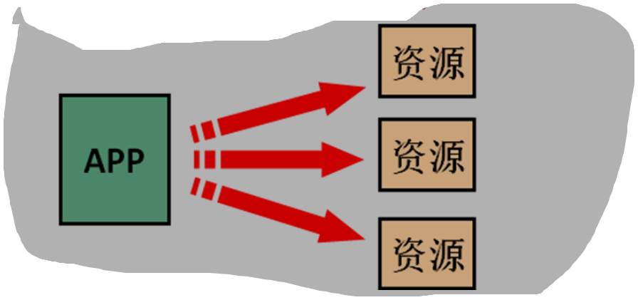
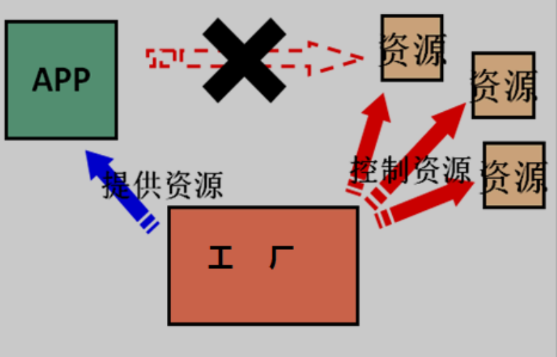
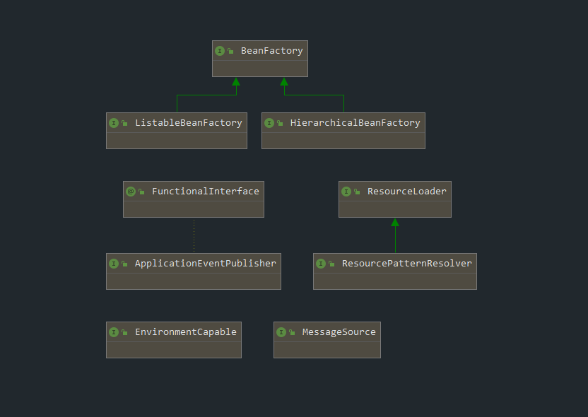
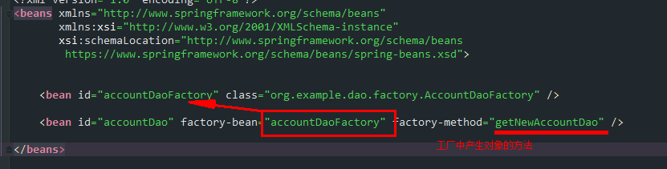

<!-- TOC -->

- [Spring概述](#spring概述)
  - [Spring概述](#spring概述-1)
    - [Spring是什么](#spring是什么)
    - [Spring 的发展历程](#spring-的发展历程)
- [IOC](#ioc)
  - [Spring中的IOC](#spring中的ioc)
  - [基于注解的IoC](#基于注解的ioc)
- [Bean](#bean)
  - [spring中的JavaBean](#spring中的javabean)
    - [创建JavaBean的三种方式](#创建javabean的三种方式)
    - [Spring中的Bean的作用范围](#spring中的bean的作用范围)
    - [Spring中的Bean的生命周期](#spring中的bean的生命周期)
- [依赖注入](#依赖注入)
  - [构造函数注入](#构造函数注入)
  - [Set方法提供](#set方法提供)
  - [复杂数据类型注入](#复杂数据类型注入)
- [AOP](#aop)
  - [相关术语](#相关术语)
  - [Spring中Aop配置及实现](#spring中aop配置及实现)
- [纯注解配置下的Spring](#纯注解配置下的spring)
  - [Spring整合Junit测试](#spring整合junit测试)

<!-- /TOC -->
# Spring概述

## Spring概述
### Spring是什么
Spring 是分层的 Java SE/EE 应用 full-stack 轻量级开源框架，以 IoC（Inverse Of Control：反转控制）和 AOP（Aspect Oriented Programming：面向切面编程）为内核，提供了展现层 Spring MVC 和持久层 Spring JDBC 以及业务层事务管理等众多的企业级应用技术，还能整合开源世界众多著名的第三方框架和类库，逐渐成为使用最多的 Java EE 企业应用开源框架。
### Spring 的发展历程
* 1997 年 IBM 提出了 EJB 的思想
* 1998 年，SUN 制定开发标准规范 EJB1.0
* 1999 年，EJB1.1 发布
* 2001 年，EJB2.0 发布
* 2003 年，EJB2.1 发布
* 2006 年，EJB3.0 发布
Rod Johnson（spring 之父）
* Expert One-to-One J2EE Design and Development(2002)阐述了 J2EE 使用 EJB 开发设计的优点及解决方案
* Expert One-to-One J2EE Development without EJB(2004)阐述了 J2EE 开发不使用 EJB 的解决方式（Spring 雏形）
* 2017 年 9 月份发布了 spring 的最新版本 spring 5.0 通用版（GA）

# IOC
控制反转
使用new创建对象时：



使用工厂创建对象：



为何叫做IOC控制反转，而不叫做工厂呢?因为我们使用new创建对象时，类拥有完全的控制权，可以随意创建具体的实现类，而当使用工厂模式时，类无法控制具体的创建对象，控制权被转移到了工厂

概念：
控制反转( Inversion of Contro,英文缩写为IoC)把创建对象的权利珓交给框架，是框架的重要特征,并非面冋对象编程的专用术语。它包括依赖注入( Dependency Injection,简称DI)和依赖查找( Dependency Lookup)。

作用：减少程序中的耦合（解除代码中的依赖关系）

## Spring中的IOC

简单使用：
1. bean配置文件
```xml
<?xml version="1.0" encoding="UTF-8"?>
<beans xmlns="http://www.springframework.org/schema/beans"
       xmlns:xsi="http://www.w3.org/2001/XMLSchema-instance"
       xsi:schemaLocation="http://www.springframework.org/schema/beans
        https://www.springframework.org/schema/beans/spring-beans.xsd">

    <bean id="accountDao" class="org.example.dao.AccountDaoImpl" />

    <bean id="accountService" class="org.example.service.AccountServiceImpl" />
</beans>
```
2. java测试代码

```java
    @org.junit.Test
    public void testSpringIoc() {
        ApplicationContext applicationContext = new ClassPathXmlApplicationContext("bean.xml");

        IAccountDao accountDao = applicationContext.getBean("accountDao", IAccountDao.class);
        System.out.println(accountDao.queryAccount());

        IAccountService accountService = applicationContext.getBean("accountService", IAccountService.class);
        accountService.saveAccount();
    }
```

ApplicationContext 有三个常用的实现类：
* ClassPathXmlApplicationContext: 可以读取类路径下的配置
* FileSystemApplicationContext: 可以读取任意路径下的配置（必须要有权限）
* AnnotationApplicationContext:读取注解配置

ApplicationContext 的类图：




ApplicationContext：立即加载，读取完配置文件时，即创建对应的对象
  - 适用于单例模式
BeanFactory：延迟加载，当根据Id获取对象时才创建
  - 适用于多例模式

## 基于注解的IoC

* @Component
* @Controller：一般用于表现层
* @Service：一般用于业务层
* @Repository：一般用于持久层
* 以上四个作用及属性完全一样：把当前类对象存入spring容器之中，value属性指定id，单他们是spring提供用于三层架构的注解，使代码更加清晰

1. 容器配置更改
```xml
<?xml version="1.0" encoding="UTF-8"?>
<beans xmlns="http://www.springframework.org/schema/beans"
       xmlns:xsi="http://www.w3.org/2001/XMLSchema-instance"
       xmlns:context="http://www.springframework.org/schema/context"
       xsi:schemaLocation="http://www.springframework.org/schema/beans
        https://www.springframework.org/schema/beans/spring-beans.xsd
        http://www.springframework.org/schema/context
        https://www.springframework.org/schema/context/spring-context.xsd">

    <context:component-scan base-package="org.example.dao" />
    <context:component-scan base-package="org.example.service" />
</beans>
```
2. 在需要spring管理的bean的类上方书写注解：
```java
@Component("accountDao")
public class AccountDaoImpl implements IAccountDao {
}
```

自动注入数据``Autowired``:
```java
@Service("accountService")
public class AccountServiceImpl implements IAccountService {

    @Autowired
    private IAccountDao accountDao;

    @Override
    public void saveAccount() {
        System.out.println("AccountServiceImpl.saveAccount" + accountDao);
    }
}
```
* 被Autowired注解的字段后，spring只要能在容易中查找到字段数据类型的唯一对象，即可注入成功
* 如果查找到多个同类型对象，则会根据字段名称以及多个同类型对象的注解ID查找，相同ID的即会被注入
* 否则失败并抛出异常


* @Component
* @Controller：一般用于表现层
* @Service：一般用于业务层
* @Repository：一般用于持久层
* @Autowired：自动注入，依据类型、字段名和bean对象ID进行匹配
* @Qualifier：根据类型及名称注入，但是不能单独在类成员上使用，需要配合@Autowired，方法参数可以
* @Resource：直接根据bean对象ID注入，可单独使用
* Autowired、Qualifie、Resource只能诸如其他bean，集合类型只能使用xml配置文件注入
* @Value：注入基本数据类型和String类型，可以使用SpELl(Spring EL表达式) ${}
* @Scope：作用域，Singleton、prototype

生命周期相关：

* PreDestory
* PostConstruct

# Bean

在计算机英语中 ``bean``有可重用组件的意思。
javabean并不等于实体类，javabean > 实体类，JavaBean时用Java语言编写的可重用组件。

## spring中的JavaBean

管理细节
1. 创建JavaBean的三种方式
2. bean对象的作用范围
3. bean对象的生命周期

### 创建JavaBean的三种方式
1. 仅有id、class属性，且类中拥有默认构造方法（否则无法创建对象）
  ```xml
    <bean id="accountDao" class="org.example.dao.AccountDaoImpl" />
  ```
2. 使用工厂方法或其他类方法创建对象并存入spring容器



3. 使用静态方法创建
```xml
<?xml version="1.0" encoding="UTF-8"?>
<beans xmlns="http://www.springframework.org/schema/beans"
       xmlns:xsi="http://www.w3.org/2001/XMLSchema-instance"
       xsi:schemaLocation="http://www.springframework.org/schema/beans
        https://www.springframework.org/schema/beans/spring-beans.xsd">
    <bean id="accountDao" class="org.example.dao.factory.AccountDaoFactory" factory-method="getNewAccountDao" />
</beans>
```
### Spring中的Bean的作用范围

指定范围可以使用 ``scope`` 属性
scope取值：
1. singleton：单例（默认）
2. prototype：多例
3. request：作用于web应用的请求方法
4. session：作用于web应用的会话方法
5. global-session：作用于集群环境的会话范围，当不是集群环境时，它就是session

### Spring中的Bean的生命周期

单例对象：
* 出生：读取完配置文件即出生
* 活着：程序未结束就一致或者
* 消亡：容器关闭即消亡
* 生命周期同容器相同

多利对象：
* 使用时出生
* 使用期间或者
* 垃圾回收时死亡

# 依赖注入

Dependenc Injection

将依赖关系交由Spring来管理，当前类需要用到的其他类对象由Spring为我们提供，我们只需要在配置文件中说明。

可以注入的三类数据：
1. 基本类型、String
2. 其他bean类型（在配置文件中或注解中配置过的bean）
3. 复杂类型、集合类型

注入的方式：
1. 使用构造函数提供
2. 使用set方法提供
3. 使用注解提供

## 构造函数注入

简单的模拟：
1. AccountDaoImpl构造函数需要参数，且无默认构造函数
```java
    public AccountDaoImpl(Date date) {
        System.out.println(date);
    }
```
2. 在配置文件中使用``constructor-arg``标签指定参数

```xml
<?xml version="1.0" encoding="UTF-8"?>
<beans xmlns="http://www.springframework.org/schema/beans"
       xmlns:xsi="http://www.w3.org/2001/XMLSchema-instance"
       xsi:schemaLocation="http://www.springframework.org/schema/beans
        https://www.springframework.org/schema/beans/spring-beans.xsd">
    <bean id="accountDao" class="org.example.dao.AccountDaoImpl">
        <constructor-arg name="date" ref="nowDate" />
    </bean>
    <bean id="nowDate" class="java.util.Date" />
</beans>
```
constructor-arg标签属性：
* type、name、index：都是用于查找参数，通常使用name即可
* ref：引用在Spring的IoC容器中出现过的bean对象
* value：给基本类型赋值

总结：改变了对象的实例化方式，创建对象时，即使我们用不到这些数据，也必须提供，因此实际开发中使用较少

## Set方法提供

```xml
<?xml version="1.0" encoding="UTF-8"?>
<beans xmlns="http://www.springframework.org/schema/beans"
       xmlns:xsi="http://www.w3.org/2001/XMLSchema-instance"
       xsi:schemaLocation="http://www.springframework.org/schema/beans
        https://www.springframework.org/schema/beans/spring-beans.xsd">
    <bean id="accountDao" class="org.example.dao.AccountDaoImpl">
        <property name="id" value="50" />
        <property name="address" value="上海" />
        <property name="birthday" ref="nowDate" />
    </bean>
    <bean id="nowDate" class="java.util.Date" />
</beans>
```
* property标签的name属性的值时set方法的名称（去掉set并将首字母小写后的名称）

总结
* 创建对象无明确限制
* 如果某个属性必须有值，则获取对象时可能没有hi下set方法


## 复杂数据类型注入

```xml
<?xml version="1.0" encoding="UTF-8"?>
<beans xmlns="http://www.springframework.org/schema/beans"
       xmlns:xsi="http://www.w3.org/2001/XMLSchema-instance"
       xsi:schemaLocation="http://www.springframework.org/schema/beans
        https://www.springframework.org/schema/beans/spring-beans.xsd">
    <bean id="accountDao" class="org.example.dao.AccountDaoImpl">
        <property name="id" value="50" />
        <property name="address" value="上海" />
        <property name="birthday" ref="nowDate" />
        <property name="map">
            <map>
                <description>map description</description>
                <entry key="key1" value="value1" />
                <entry key="key2" value="value2" />
                <entry key="key3" value="value3" />
            </map>
        </property>
        <property name="properties">
            <props>
                <prop key="properties">spring dj</prop>
            </props>
        </property>
    </bean>
    <bean id="nowDate" class="java.util.Date" />
</beans>
```

# AOP

在软件业,AOP为 ``Aspect Oriented Programming``的縮写,意为:**面向切面编程**，通过预编译方式和运行期 **动态代理** 实现程序功能的统一维护的一种技术。AOP是OOP的延续,是软件开发中的一个热点,也是 Spring 框架中的一个重要内容,是函数式编程的一种衍生范型。利用AOP可以对业务逻辑的各个部进行隔离,从而使得业务逻辑各部分之间的耦合度降低,提高程序的可重用性,同时提高了开发的效率。

简单的说它就是把我们程序重复的代码抽取出来，在需要执行的时候，使用动态代理的技术，在 **不修改源码** 的基础上，对我们的已有方法进行增强。

作用：在程序运行期间，不修改源码对已有方法进行增强。
优势：
- 减少重复代码
- 提高开发效率
- 维护方便

实现方式：动态代理

动态代理：
1. 基于接口的动态代理：JDK自带的Proxy，要求至少实现一个接口
2. 基于子类的动态代理：第三方包CGLIB提供（如果报 asmxxxx 异常，需要导入 asm.jar），要求被代理类不能用 final 修饰的类（最终类）。

## 相关术语
 * Joinpoint(连接点)
 所谓连接点是指那些被拦截到的点。在 spring 中,这些点指的是方法,因为 spring 只支持方法类型的连接点。
 > 接口中的所有方法都是连接点

 * Pointcut(切入点)
 所谓切入点是指我们要对哪些 Joinpoint 进行拦截的定义。
 > 增强方法中经过处理的方法都是切入点

 * Advice(通知/增强):
 所谓通知是指拦截到 Joinpoint 之后所要做的事情就是通知。通知的类型：前置通知,后置通知,异常通知,最终通知,环绕通知。


 * Introduction(引介):
 引介是一种特殊的通知在不修改类代码的前提下, Introduction 可以在运行期为类动态地添加一些方法或 Field。
 * Target(目标对象):
 代理的目标对象。
 * Weaving(织入):
 是指把增强应用到目标对象来创建新的代理对象的过程。spring 采用动态代理织入，而 AspectJ 采用编译期织入和类装载期织入。
 * Proxy（代理）:
 一个类被 AOP 织入增强后，就产生一个结果代理类。
 * Aspect(切面):
 是切入点和通知（引介）的结合。

## Spring中Aop配置及实现

1. 相关依赖
   ```xml
        <dependency>
            <groupId>org.springframework</groupId>
            <artifactId>spring-context</artifactId>
            <version>5.2.7.RELEASE</version>
        </dependency>

        <dependency>
            <groupId>org.aspectj</groupId>
            <artifactId>aspectjweaver</artifactId>
            <version>1.8.7</version>
        </dependency>
   ```
2. aop相关配置
```xml
<?xml version="1.0" encoding="UTF-8"?>
<beans xmlns="http://www.springframework.org/schema/beans"
       xmlns:xsi="http://www.w3.org/2001/XMLSchema-instance"
       xmlns:aop="http://www.springframework.org/schema/aop"
       xmlns:context="http://www.springframework.org/schema/context"
       xsi:schemaLocation="http://www.springframework.org/schema/beans
        https://www.springframework.org/schema/beans/spring-beans.xsd
        http://www.springframework.org/schema/context
        https://www.springframework.org/schema/context/spring-context.xsd
        http://www.springframework.org/schema/aop
        https://www.springframework.org/schema/aop/spring-aop.xsd">

    <context:component-scan base-package="org.example.service"/>

    <bean id="accountService" class="org.example.service.AccountServiceImpl" />
    <bean id="accountDao" class="org.example.dao.AccountDaoImpl" />
    <bean id="queryRunner" class="org.apache.commons.dbutils.QueryRunner" />
    <bean id="dataSource" class="org.apache.commons.dbcp2.BasicDataSourceFactory" factory-method="createDataSource" >
        <constructor-arg>
            <props>
                <prop key="driverClassname">com.mysql.cj.jdbc.Driver</prop>
                <prop key="url">jdbc:mysql://localhost:3306/test_db</prop>
                <prop key="username">root</prop>
                <prop key="password">123</prop>
            </props>
        </constructor-arg>
    </bean>

    <bean id="logger" class="org.example.log.Logger"/>

    <aop:config>
        <!--   配置切面     -->
        <aop:aspect ref="logger">
            <aop:before method="debug" pointcut="execution( public void org.example.service.AccountServiceImpl.saveAccount())" />
        </aop:aspect>
    </aop:config>
</beans>
```

切入点表达式写法
  1. 访问修饰符可以省略
  2. 返回值可以使用通配符，表示任意返回值
  3. 包名可以使用通配符 *
      * 几级包，就需要几个*： ``*.*.*``
      * .. 表示当前包及其子包
      * 类名、方法名可以使用 * 通配
  5. 参数列表
      * 基本数据类型可以直接写名称
      * 引用类型写 *包名.类名的方式*
      * 可以使用通配符 \*，但是必须要有参数
      * 使用.. 有无参数都可以匹配，有参数匹配任意类型
  6. 全通配符写法：``* *..*.*(..)``

3. 几种通知类型

```xml
    <aop:config>
        <aop:pointcut id="savePointCut" expression="execution(* org.example.service.AccountServiceImpl.saveAccount())"/>

        <!--   配置切面     -->
        <aop:aspect ref="logger">
            <aop:before method="before" pointcut-ref="savePointCut" />

            <aop:after method="after" pointcut-ref="savePointCut" />

            <aop:around method="around" pointcut-ref="savePointCut" />
        </aop:aspect>
    </aop:config>
```
4. 环绕通知方法
```Java
    public void around(ProceedingJoinPoint joinPoint) {
        System.out.println("环绕增强====>");
        try {
            System.out.println("环绕增强 前置通知........");
            joinPoint.proceed();
            System.out.println("环绕增强 后置通知........");

        } catch (Throwable throwable) {
            System.out.println("环绕增强 异常通知: " + throwable);
        } finally {
            System.out.println("环绕增强 最终通知");
            System.out.println("<=====环绕增强");
        }
    }
```
5. 运行结果


# 纯注解配置下的Spring

1. @Configuration：写于类上方，指定此类作为Spring的配置类，进行注解读取
2. @ComponentScan：告知Spring注解扫描区域（包）
3. @Bean：用于方法，指示方法生成的对象交由Spring管理
   - 如果方法中带有参数，则会按照``@Autowired``的方式寻找参数
   - 即首先，唯一类型匹配?字段名字匹配?
4. @Autowired：As of Spring Framework 4.3, an @Autowired annotation on such a constructor is no longer necessary if the target bean defines only one constructor to begin with. 从4.3开始，如果目标bean只有一个带参构造函数，则无需使用此注解；单存在多个构造函数，且没有默认构造函数时，必须提供至少一个此注解
5. @import：导入其他配置类中的配置

* 总结：纯注解配置实际上并没有带来便利，实际上变得更加麻烦了，并且配置变得太过于分散，不好控制，但如何使用，是视情况而定的

## Spring整合Junit测试

```java
@RunWith(SpringJUnit4ClassRunner.class)
@ContextConfiguration(classes = SpringConfig.class)
public class BeanFactoryTest {
    @Autowired
    private IAccountService accountService;

    @Test
    public void testQueryById() {
        System.out.println(accountService.queryById(1));
    }

    @Test
    public void testDeleteOne() {
        accountService.deleteAccountById(3);
    }
}
```

* Junit的版本必须高于4.12
* 使用@RunWith（Junit提供）注解：``@RunWith(SpringJUnit4ClassRunner.class)``
* 使用@ContextConfiguration（Spring）注解：指定配置类或配置文件``@ContextConfiguration(classes = SpringConfig.class)``
* 然后即可使用自动注入@Autowired，
