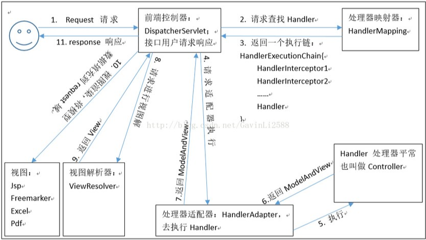
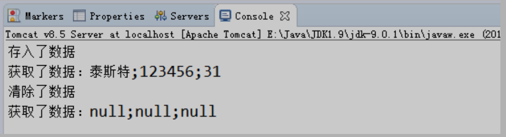
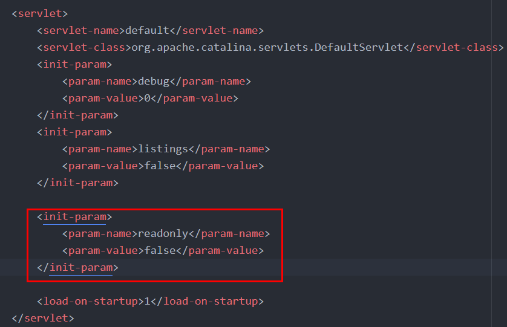

[toc]

# Spring MVC 简介

MVC：

* Model：模型，JavaBean，用于三层之数据的传递。
* View：视图，通常为Jsp页面，用于向用户展示页面
* Controller：控制器，通常为各个Servlet，用于分析、处理并转发请求到业务层

Spring MVC的简要介绍：

SpringMVC 是一种基于 Java 的实现 MVC 设计模型的请求驱动类型的轻量级 Web 框架，属于 Spring FrameWork 的后续产品，已经融合在 Spring Web Flow 里面。Spring 框架提供了构建 Web 应用程序的全功能 MVC 模块。使用 Spring 可插入的 MVC 架构，从而在使用 Spring 进行 WEB 开发时，可以选择使用 Spring的 Spring MVC 框架或集成其他 MVC 开发框架，如 Struts1(现在一般不用)，Struts2 等。

SpringMVC 已经成为目前最主流的 MVC 框架之一，并且随着 Spring3.0 的发布，全面超越 Struts2，成为最优秀的 MVC 框架。它通过一套注解，让一个简单的 Java 类成为处理请求的控制器，而无须实现任何接口。同时它还支持RESTful 编程风格的请求。

# Spring MVC 入门程序

1. 搭建 maven项目，选择原型:``webapps``

2. 配置web.xml：配置spring mvc前端控制器（servlet）的映射：

   ```xml
   <!-- spring核心控制器配置 -->
     <servlet>
       <servlet-name>dispatcherServlet</servlet-name>
       <servlet-class>org.springframework.web.servlet.DispatcherServlet</servlet-class>
     </servlet>

     <servlet-mapping>
       <servlet-name>dispatcherServlet</servlet-name>
       <url-pattern>/</url-pattern>
     </servlet-mapping>
   ```

3. 配置spring mvc配置文件

4. 为控制器添加注解：@Controller，是@Component的特化

5. 映射前端请求到具体控制器的方法

   ```java
   @RequestMapping("/hello")
   public void requestMap() {
       System.out.println("Hello Spring MVC!");
   }
   ```

   此后访问 ``/hello``都会执行此方法

6. 配置web.xml使Tomcat启动时加载 Spring MVC的配置文件

   ```xml
   <servlet>
     <servlet-name>dispatcherServlet</servlet-name>
     <servlet-class>org.springframework.web.servlet.DispatcherServlet</servlet-class>
     <init-param>
       <param-name>contextConfigLocation</param-name>
       <param-value>classpath:springmvc.xml</param-value>
     </init-param>
     <load-on-startup>1</load-on-startup>
   </servlet>
   ```

7. 在Spring配置文件中配置 **视图解析对象**

   ```xml
   <!--  视图解析器对象  -->
   <bean id="viewResolver" class="org.springframework.web.servlet.view.InternalResourceViewResolver">
       <!--  前缀，在此配置目录下寻找返回页面 -->
       <property name="prefix" value="/WEB-INF/pages/"/>
       <!-- 后缀，返回页面文件后缀 -->
       <property name="suffix" value=".jsp"/>
   </bean>
   ```

8. 在Spring配置文件中配置 Spring MVC的注解配置支持

   ```xml
   <!--开启spring mvc注解配置支持-->
   <mvc:annotation-driven/>
   ```

9. 编写index.jsp，测试访问 hello

   ```html
   <a href="hello">Hello Spring MVC</a>
   ```

10. 执行成功


疑问：为何可以访问到 ``WEB-InF``目录下的jsp文件，以我之前学习javaweb结论告诉我，``WEB-INF``目录是不能访问的（或者说不能随意访问），因为权限不够，单位和 Spring MVC能访问呢？

## 执行过程

1. 当启动Tomcat服务器的时候，因为配置了load-on-startup标签，所以会创建DispatcherServlet对象，就会加载springmvc.xml配置文件

2. 开启了注解扫描，那么HelloController对象就会被创建

3. 从index.jsp发送请求，请求会先到达DispatcherServlet核心控制器，根据配置@RequestMapping注解找到执行的具体方法

4. 根据执行方法的返回值，再根据配置的视图解析器，去指定的目录下查找指定名称的JSP文件

5. Tomcat服务器渲染页面，做出响应



入门程序使用到的组件：

1. 前端控制器（DispatcherServlet）

2. 处理器映射器（HandlerMapping）

3. 处理器（Handler）

4. 处理器适配器（HandlAdapter）

5. 视图解析器（View Resolver）

6. 视图（View）


## RequestMapping注解

建立访问url与方法之间的映射关系

* 可以使用在类和方法之上，以``/路径``使用
* 类上不使用时表示根路径

属性：
* value：指定映射的路径同path
* path：同value
* method（RequestMethod枚举对象）：指定请求方法
* params：用于指定参数限制条件，**请求参数必须和配置一摸一样**

  - params = {"accountName"}，表示请求参数必须有 accountName
  - params = {"moeny!100"}，表示请求参数中 money 不能是 100。

* headers：用于指定限制消息头的条件（浏览器中F12->网络可以查看到请求头）


# 请求参数的绑定

SpringMVC 绑定请求参数的过程是通过把表单提交请求参数，作为控制器中方法参数进行绑定

支持的数据类型：
1. 支持基本数据类型+String
2. 支持JavaBean类型
3. 支持集合数据类型（List、Map）

使用：只要遵循几个要求，Spring MVC会自动的进行参数绑定


1. 严格区分大小写
2. 请求参数名称与方法参数名称一致
3. 如果是POJO类型，则可以通过类似 ``address.provinceName`` 方式进行绑定，同样需要保证参数名称一致
```java
public class Account{
  //....
  private Address address;
}
public class Address{
  private String provinceName;
  private String cityName;
}
```
4. List：
```html
<!-- List<Account> accounts; -->
账户 1 名称：<input type="text" name="accounts[0].name" ><br/>
账户 2 名称：<input type="text" name="accounts[1].name" ><br/>
```
5. Map
```html
<!-- Map<String,Account> accountMap -->
账户 3 名称：<input type="text" name="accountMap['one'].name" ><br/>
账户 4 名称：<input type="text" name="accountMap['two'].name" ><br/>
```

## 请求参数乱码

1. 使用SpringMVC提供的过滤器解决
2. 在web.xml中配置
```xml
    <!--配置Spring MVC提供的过滤器解决中文乱码-->
    <filter>
        <filter-name>characterEncodingFilter</filter-name>
        <filter-class>org.springframework.web.filter.CharacterEncodingFilter</filter-class>
        <init-param>
            <param-name>encoding</param-name>
            <param-value>UTF-8</param-value>
        </init-param>

        <init-param>
            <param-name>forceEncoding</param-name>
            <param-value>true</param-value>
        </init-param>
    </filter>
```


## 获取原生ServletAPI


如果想要获取Servlet的原生API，也就是获取 ``HttpServletRequest``，``HttpServletResponse``对象。

很简单，在控制器方法中直接协商对应参数即可， Spring MVC会自动传参数进来：

```java
    @RequestMapping("/convert")
    public String dateConvert(Date date, HttpServletRequest request) {
        System.out.println("TestController.dateConvert");
        System.out.println("date = " + date);

        System.out.println("request = " + request);
        return "success";
    }
```

# 常用注解

## @RequestParams

把请求中指定名称的参数给控制器中的形参赋值

**属性：**

* value：请求参数中的名称。

* required：请求参数中是否必须提供此参数。默认值：true。表示必须提供，如果不提供将报错。

```java
public String useRequestParam(@RequestParam("name")String username,@RequestParam(value="age",required=false)Integer age){
System.out.println(username+","+age);
return "success"; 
}
```

## @RequestBody

用于获取请求体内容。直接使用得到是 key=value&key=value...结构的数据。get 请求方式不适用。

属性：

* required：是否必须有请求体。默认值是:true。当取值为 true 时,get 请求方式会报错。如果取值为 false，get 请求得到是 null。


使用：

```java
@RequestMapping("/useRequestBody")
public String useRequestBody(@RequestBody(required=false) String body){
    System.out.println(body);
	return "success"; 
}
```

## @PathVaribale

用于绑定 url 中的占位符。例如：请求 url 中 /delete/**{id}**，这个**{id}**就是 url 占位符。url 支持占位符是 spring3.0 之后加入的。是 springmvc 支持 rest 风格 URL 的一个重要标志。

属性：

* value：用于指定 url 中占位符名称。

* required：是否必须提供占位符。

使用：

* jsp代码

  ```html
  <a href="springmvc/usePathVariable/100">pathVariable 注解</a>
  ```

* java代码

  ```java
  @RequestMapping("/usePathVariable/{id}")
  public String usePathVariable(@PathVariable("id") Integer id){
  	System.out.println(id);
  	return "success"; 
  }
  ```

  

## @RequestHeader

用于获取请求消息头。

**属性：**

* value：提供消息头名称

* required：是否必须有此消息头

```java
@RequestMapping("/useRequestHeader")
public String useRequestHeader(@RequestHeader(value="Accept-Language",required=false)String requestHeader){
	System.out.println(requestHeader);
	return "success";
}
```

## @ CookieValue

用于把指定 cookie 名称的值传入控制器方法参数。

**属性：**

* value：指定 cookie 的名称。

* required：是否必须有此 cookie。

```java
@RequestMapping("/useCookieValue")
public String useCookieValue(@CookieValue(value="JSESSIONID",required=false) String cookieValue){
	System.out.println(cookieValue);
	return "success";
}
```

## @ModelAttribute

该注解是 SpringMVC4.3 版本以后新加入的。它可以用于修饰方法和参数。出现在方法上，表示当前方法会在控制器的方法执行之前，先执行。它可以修饰没有返回值的方法，也可以修饰有具体返回值的方法。出现在参数上，获取指定的数据给参数赋值。

**属性：**

* value：用于获取数据的 key。

* key 可以是 POJO 的属性名称，也可以是 map 结构的 key

**应用场景：**

当表单提交数据不是完整的实体类数据时，保证没有提交数据的字段使用数据库对象原来的数据。

例如：

我们在编辑一个用户时，用户有一个创建信息字段，该字段的值是不允许被修改的。在提交表单数据是肯定没有此字段的内容，一旦更新会把该字段内容置为 null，此时就可以使用此注解解决问题。

```java
@ModelAttribute
public User showModel(String username) {
	//模拟去数据库查询
	User abc = findUserByName(username);
	System.out.println("执行了 showModel 方法"+abc);
	return abc; 
}

// 模拟修改用户方法
@RequestMapping("/updateUser")
public String testModelAttribute(User user) {
	System.out.println("控制器中处理请求的方法：修改用户："+user);
	return "success";
}

// 模拟去数据库查询
private User findUserByName(String username) {
	User user = new User();
	user.setUsername(username);
	user.setAge(19);
	user.setPassword("123456");
	return user; 
}
```

* ModelAttribute修饰的具有返回值的方法，返回值中的一部分数据会被替换为请求中的参数值

## @SessionAttribute

用于多次执行控制器方法间的参数共享。

**属性：**

* value：用于指定存入的属性名称

* type：用于指定存入的数据类型。

```java
@Controller("sessionAttributeController")
@RequestMapping("/springmvc")
@SessionAttributes(value ={"username","password"},types={Integer.class}) 
public class SessionAttributeController {
/**
* 把数据存入 SessionAttribute
* Model 是 spring 提供的一个接口，该接口有一个实现类 ExtendedModelMap
* 该类继承了 ModelMap，而 ModelMap 就是 LinkedHashMap 子类
*/
@RequestMapping("/testPut") 
public String testPut(Model model){ 
 	model.addAttribute("username", "泰斯特"); 
 	model.addAttribute("password","123456"); 
 	model.addAttribute("age", 31); 
 	//跳转之前将数据保存到 username、password 和 age 中，因为注解@SessionAttribute 中有这几个参数 
 	return "success"; 
 } 
 
 @RequestMapping("/testGet") 
 public String testGet(ModelMap model){ 
 	 System.out.println(model.get("username")+";"+model.get("password")+";"+model.get("age")); 
	 return "success"; 
 } 
 
 @RequestMapping("/testClean") 
 public String complete(SessionStatus sessionStatus){ 
	 	sessionStatus.setComplete(); 
 		return "success"; 
 	} 
}
```



* Model.setAttribute()方法实际上是将数据存储在``request``域之中的

* @SessionAttributes注解则会让对应属性名的属性同时存储在 ``session``域之中

* @SessionAttribute()注解用于参数之上，可以用于从session域之中取对应属性的值并赋值给（控制器）方法参数

  ```java
  @RequestMapping("/sessionAttr")
  /** Spring MVC会从session中查找名叫 sessionAttr 的属性，并赋值给形参，也可以通过注解属性指定读取的属性 */
  public String testSessionAttribute(@SessionAttribute int sessionAttr) {
      System.out.println("sessionAttr = " + sessionAttr);
      return "success";
  }
  ```

# 响应JSON数据

因为我们在<font color="red">webxml</font>中配置了Spring MVC的核心控制器，拦截了一切请求，这会导致我们的静态资源也会被拦截，例如js、css、image等静态资源，为了避免被拦截，需要在SpringMVC配置文件中指定不被拦截的资源：

```xml
<mvc:resources location="/js/"  mapping="/js/**" />
```


## Bean与Json数据互转

``Springmvc`` 默认用 <font color="red">MappingJacksonHttpMessageConverter </font>对 json 数据进行转换，需要加入``jackson ``的包。

Maven坐标：

```xml
<dependency>
    <groupId>com.fasterxml.jackson.core</groupId>
    <artifactId>jackson-databind</artifactId>
    <version>2.11.1</version>
</dependency>

<dependency>
    <groupId>com.fasterxml.jackson.core</groupId>
    <artifactId>jackson-core</artifactId>
    <version>2.11.1</version>
</dependency>

<dependency>
    <groupId>com.fasterxml.jackson.core</groupId>
    <artifactId>jackson-annotations</artifactId>
    <version>2.11.1</version>
</dependency>
```


使用方法：通过AJAX传递的JSON数据会自动地被转换为Bean对象。

```java
@RequestMapping("/ajax")
public @ResponseBody User testAjax(@RequestBody User user) {
    System.out.println("UserController.testAjax");
    System.out.println(user);
    
    user.setUsername("zhang");

    return user;
}
```

* **@RequestBody**可以自动把JSON数据转为Java Bean
* **@ResponseBody**可以把Java Bean转为Json数据


# 文件上传

1. form表单的enctype取值必须是：``multipart/form-data``，默认值为``application/x-www-form-urlencoded`` 

2. method必须是post（get方式数据会在地址栏显示，且有大小限制，4k）

3. 提供一个文件选择域

   ```html
   <form action="uploadImage" method="post" enctype="multipart/form-data">
       <label>选择上传文件<input type="file" /></label>
   </form>
   ```


## 原理分析

当 form 表单的 enctype 取值不是默认值后，request.getParameter()将失效。 enctype="application/x-www-form-urlencoded"时，form 表单的正文内容是：key=value&key=value&key=value

当 form 表单的 enctype 取值为 Mutilpart/form-data 时，请求正文内容就变成：

每一部分都是 MIME 类型描述的正文

\-----------------------------7de1a433602ac  **分界符**

Content-Disposition: form-data; name="userName" **协议头**

aaa **协议的正文**

\-----------------------------7de1a433602ac

Content-Disposition: form-data; name="file"; filename="C:\Users\zhy\Desktop\fileupload_demofile\b.txt"

Content-Type: text/plain **协议的类型（MIME 类型）**

bbbbbbbbbbbbbbbbbbbbbbbbbbbbbbbb

\-----------------------------7de1a433602ac--


借助三方组件实现文件上传

* Commons-fileupload 
* commons-io。

commons-io 不属于文件上传组件的开发 jar 文件，但Commons-fileupload 组件从 1.1 版本开始，它工作时需要 commons-io 包的支持。


## Spring MVC传统文件上传方式

> 传统方式的文件上传，指的是我们上传的文件和访问的应用存在于同一台服务器上。并且上传完成之后，浏览器可能跳转。

1. 编写jsp页面

   ```html
   <form action="uploadImage" method="post" enctype="multipart/form-data">
       <label>选择上传文件<input type="file" name="image" /></label><br>
       <input type="submit" value="上传">
   </form>
   ```

   * file输入框必须要有name属性，否则无法解析数据

2. 编写控制器java代码

   ```java
       @RequestMapping("/uploadImage")
       public String uploadImage(HttpServletRequest request) throws Exception {
           String path = request.getSession().getServletContext().getRealPath("/upload/");
           File file = new File(path);
           if (!file.exists()) {
               file.mkdirs();
           }
   
           DiskFileItemFactory fileItemFactory = new DiskFileItemFactory();
           ServletFileUpload fileUpload = new ServletFileUpload(fileItemFactory);
           List<FileItem> fileItems = fileUpload.parseRequest(request);
           for (FileItem fileItem : fileItems) {
               if (fileItem.isFormField()) {
                   System.out.println(fileItem.getName());
               } else {
                   String name = fileItem.getName();
                   String uuid = UUID.randomUUID().toString().replace("-", "");
                   name = uuid + "_" + name;
                   fileItem.write(new File(path, name));
                   // 删除临时文件
                   fileItem.delete();
               }
           }
   
           return "success";
       }
   ```

   * 项目打包路径在``target\SpringMVC\upload\.....``

## SpringMVC跨服务器的文件上传方式

在实际开发中，我们会有很多处理不同功能的服务器。例如：

* 应用服务器：负责部署我们的应用

* 数据库服务器：运行我们的数据库

* 缓存和消息服务器：负责处理大并发访问的缓存和消息

* 文件服务器：负责存储用户上传文件的服务器。

**(注意：此处说的不是服务器集群）**

**分服务器处理的目的是让服务器各司其职，从而提高我们项目的运行效率。**


步骤：

1. 配置文件解析器

   ```xml
   <!--  配置文件解析器 -->
   <bean id="multipartResolver" class="org.springframework.web.multipart.commons.CommonsMultipartResolver">
       <property name="maxUploadSize" value="10485760" />
   </bean>
   ```

2. 导入biyaojar包：jersey（由sun公司提供）

   ```xml
   <dependency>
       <groupId>com.sun.jersey</groupId>
       <artifactId>jersey-core</artifactId>
       <version>1.18.1</version>
   </dependency>
   
   <dependency>
       <groupId>com.sun.jersey</groupId>
       <artifactId>jersey-client</artifactId>
       <version>1.18.1</version>
   </dependency>
   ```
   
3. 修改处理文件上传的java代码

   ```java
   @RequestMapping("/uploadImage")
   public String uploadImage(MultipartFile upload) throws Exception {
           String filename = upload.getOriginalFilename();
           String uuid = UUID.randomUUID().toString().replace("-", "");
           filename = uuid + "_" + filename;
   
           // 创建 sun 公司提供的 jersey 包中的 Client 对象
           Client client = Client.create();
           // 指定上传文件的地址，该地址是 web 路径
           WebResource webResource = client.resource(URL + filename);
           String result = webResource.put(String.class, upload.getBytes());
           System.out.println(result);
   
           return "success";
       return "success";
   }
   ```

* 文件服务器（Tomcat）需要配置web.xml，需要加上启动参数``readonly``，设置为false，否则无法写入文件

  

* 需要手动在服务器建立 uploads文件夹

* 方法中 ``MultipartFile``参数名称必须和form表单中上传文件的输入框 name属性值一样

* 文件解析器 bean 的id值必须是``multipartResolver``

* Maven中的打包方式会影响 ``resource``资源会不会加载到classpath，改为jar

# Spring MVC 异常处理

如果不做特殊处理，Mybatis、Spring、Spring MVC对于异常的默认处理方式都是向上抛出，最终异常会被抛出到前端页面上。


在Spring MVC中可以配置异常处理器组件，负责处理异常并返回错误页面。

1. 自定义异常类

2. 定义异常处理器，需要继承``HandlerExceptionResvloer``

   ```java
   public class SystemExceptionResolver implements HandlerExceptionResolver {
   
       /** 处理异常 */
       @Override
       public ModelAndView resolveException(HttpServletRequest httpServletRequest, HttpServletResponse httpServletResponse, Object o, Exception e) {
           SystemException systemException;
           if (e instanceof SystemException) {
               systemException = (SystemException) e;
           } else {
               systemException = new SystemException("系统维护");
           }
   
           ModelAndView view = new ModelAndView("error");
           view.addObject("errorMsg", systemException);
   
           return view;
       }
   }
   ```

3. 配置异常处理器：在配置文件中添加bean

   ```xml
   <bean id="systemExceptionResolver" class="pers.crobin.exception.SystemExceptionResolver" />
   ```

4. 在代码中抛出对应异常

   ```java
   @RequestMapping("/testException")
   public String testException() throws SystemException {
       System.out.println("UserController.testException");
       try {
           throw new NullPointerException("模拟异常");
       } catch (Exception e) {
           throw new SystemException();
       }
   }
   ```

5. 运行结果

   

# Spring MVC 拦截器

Spring MVC 的处理器拦截器类似于 Servlet 开发中的过滤器 Filter，用于对处理器（Controller）进行预处理和后处理。

谈到拦截器，还要向大家提一个词——**拦截器链（Interceptor Chain）**。拦截器链就是将拦截器按一定的顺序联结成一条链。在访问被拦截的方法或字段时，拦截器链中的拦截器就会按其之前定义的顺序被调用。

它与Servlet中过滤器的区别：

**过滤器**是 servlet 规范中的一部分，任何 java web 工程都可以使用。

**拦截器**是 SpringMVC 框架自己的，只有使用了 SpringMVC 框架的工程才能用。

**过滤器**在 url-pattern 中配置了**/***之后，可以对所有要访问的资源拦截。

**拦截器**只会拦截访问的控制器方法，如果访问的是 jsp，html,css,image 或者 js 是不会进行拦截的。

它也是**AOP 思想的具体应用**。

我们要想自定义拦截器， 要求必须实现：**HandlerInterceptor** **接口。**


步骤：

1. 编写自己的拦截器

   ```java
   public class MyInterceptor implements HandlerInterceptor {
   
       @Override
       public boolean preHandle(HttpServletRequest request, HttpServletResponse response, Object handler) throws Exception {
           System.out.println("MyInterceptor.preHandle");
   
           return true;
       }
   }
   ```

   * 返回true方向；返回false拦截

2. 配置拦截器

   ```xml
   <!-- 配置拦截器 -->
   <mvc:interceptors>
       <mvc:interceptor>
           <mvc:mapping path="/user/*"/>
           <bean id="myInterceptor" class="pers.robin.interceptor.MyInterceptor" />
       </mvc:interceptor>
   </mvc:interceptors>
   ```


* preHandle()：controller方法执行前执行
* postHandle()：controller方法执行后执行
* afterCompletion()：jsp页面执行后执行


# 自定义类型转换器

有时Spring MVC默认的请求参数到方法参数的类型转换器可能并不能满足我们的需求，如String到Date的转换。

1. 自定义转换器需要实现一个接口：
```java
// S是转换的源类型，T是转换的目标类型
public interface Converter<S, T> {
    @Nullable
    T convert(S var1);
}

public class StringToDateConverter implements Converter<String, Date> {
    @Override
    public Date convert(String source) {
        DateFormat format;
        try {
            if(StringUtils.isEmpty(source)) {
                throw new NullPointerException("请输入要转换的日期");
            }
            format = new SimpleDateFormat("yyyy-MM-dd");
            return format.parse(source);
        } catch (Exception e) {
            throw new RuntimeException("输入日期有误");
        }
    }
}
```
2. 在配置文件中配置自定义的转换器
```xml
<!--  配置类型转换工厂  -->
    <bean id="converterService" class="org.springframework.context.support.ConversionServiceFactoryBean">
        <property name="converters">
            <array>
                <bean class="pers.crobin.converter.StringToDateConverter" />
            </array>
        </property>
    </bean>

    <!--开启spring mvc注解配置支持-->
    <!-- annotation-driven 标签中引用配置的类型转换服务-->
    <mvc:annotation-driven conversion-service="converterService"/>
```
3. java方法定义
```java
    public Date convert(String source) {
      //...                                                                                                                                                                                                                                                                                                       
    }
```
