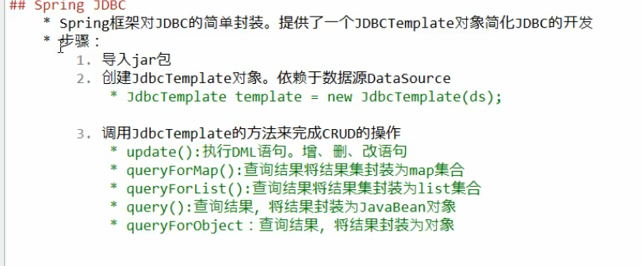
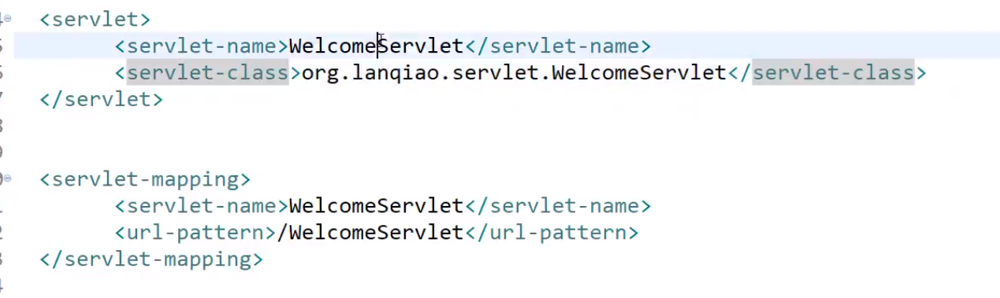
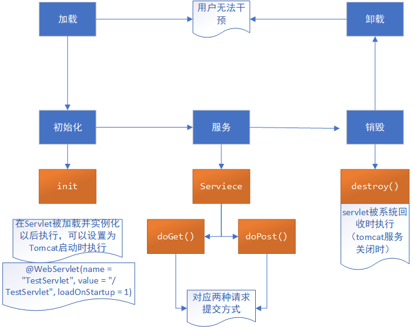
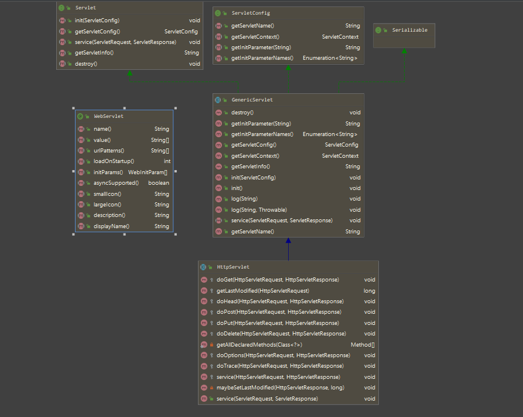
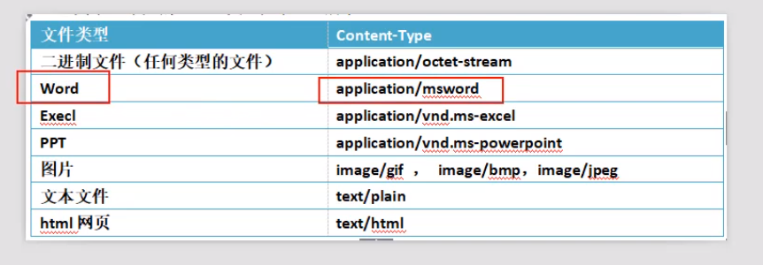
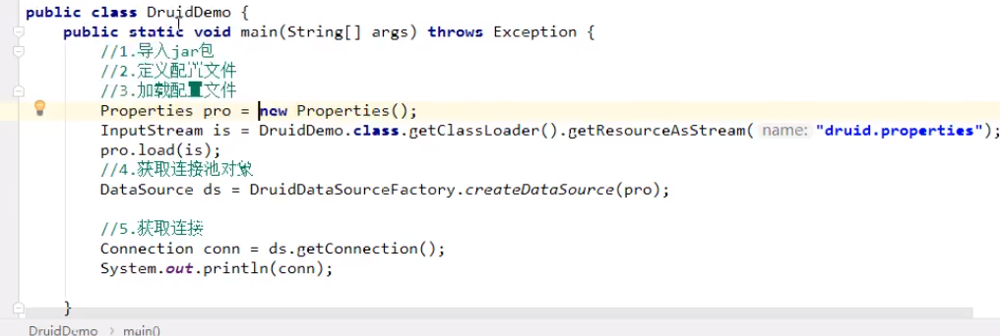

= JSP执行流程
:toc: left
:toc-title: Table of Contents
:toclevels: 4
:sectnums:
:sectnumlevels: 3
:sectanchors:
:sectlinks:
:partnums:

== 第一次访问流程

[source,mermaid]
----
graph LR
A[JSP] -->B[Java]-->C[class]
    F[JSP执行流程]
----

* JSP=\=>Java( Servlet文件)=\=>Class
* Class保存位置：%APACHE_HOME%/work/Catalina/localhost/%PROJECT_NAME%/org/apache/jsp
* jsp与servlet文件可以相互转换
* 首次访问因需要翻译JSP，并编译为Class所以会比较慢

== 第二次访问

直接访问Class文件

* 如果服务端代码修改，需要重新翻译、编译JSP

== 目录结构

=== WEB-INF

权限较高，客户端无法直接访问其中的文件，只能通过请求转发访问（代码访问）

注意：并不是任何跳转都能访问WEB-INF，

跳转：请求转发、重定向

== JSP页面元素

. Scriptlet

out.println()并不能回车，分行，因为输出时html页面，需要回车需要输出"  ",通过便签回车

. 指令

page指令：

[source,jsp]
----
<%@ page contentType="text/html;charset=UTF-8" language="java" import="java.util.Date"%>
----

. 注释

* html注释 <!-- -->
* java注释 // /* */
* jsp注释<%-- --%>

== JSP内置对象

* out
* pageContext

=== request

请求对象，存储"`客户端向服务端发送的请求信息`"

常见方法：

[source,java]
----
//key-value
public String getParameter(String s);
//key-value 返回的value属性的内容，输入框是用户输入的内容
public String[]getParameterValues(String s);
//设置请求编码 不设置时使用Tomcat的默认编码，Tomcat7以前为iso-8859-1 8及以后为utf-8
public void setCharacterEncoding(String s)throws java.io.UnsupportedEncodingException
//请求转发
public javax.servlet.RequestDispatcher getRequestDispatcher(String s);
//获取项目的ServerletContext对象
public javax.servlet.ServletContext getServletContext();
----

* 统一请求（request）的编码(适用于get提交)

直接修改Tomcat server.xml 在``Connector``标签中添加属性 `URIEncoding="UTF-8"`

[source,xml]
----

<Connector port="9999" protocol="HTTP/1.1" connectionTimeout="20000" redirectPort="8443"
  URIEncoding="UTF-8"/>
----

* 修改post提交的编码

[source,java]
----
request.setCharacterEncoding("utf-8");
----

==== 示例

____
注册
____

register.jsp

[source,jsp]
----
<%--
  Created by IntelliJ IDEA.
  User: Administrator
  Date: 2020/6/15
  Time: 18:53
  To change this template use File | Settings | File Templates.
--%>
<%@ page contentType="text/html;charset=UTF-8" language="java" %>
<html>
<head>
    <title>注册</title>
</head>
<body>
<form action="show.jsp" method="get">
    <label>
        用户名：<input type="text" name="userName" placeholder="请输入用户名"/> 
    </label>

    <label>
        密码：<input type="password" name="userPassword" placeholder="请输入密码"/> 
    </label>

    <label>
        年龄：<input type="text" name="userAge"/> 
    </label>

    <label>
        <input type="checkbox" name="userHobbies" value="basketball"/> 篮球  
    </label>

    <label>
        <input type="checkbox" name="userHobbies" value="football"/> 足球  
    </label>
    <input type="submit" value="注册">
</form>
</body>
</html>
----

show.jsp

[source,jsp]
----
<%--
  Created by IntelliJ IDEA.
  User: Administrator
  Date: 2020/6/15
  Time: 19:06
  To change this template use File | Settings | File Templates.
--%>
<%@ page contentType="text/html;charset=UTF-8" language="java" %>
<html>
<head>
    <title>注册结果</title>
</head>
<body>
    <%
        //设置post编码
        request.setCharacterEncoding("utf-8");
        String name = request.getParameter("userName");
        String password =request.getParameter("userPassword");
        int age = Integer.parseInt(request.getParameter("userAge"));
        String[] hobbies = request.getParameterValues("userHobbies");
    %>
    注册成功 
    姓名：<%=name%> 
    年龄：<%=age%> 
    密码：<%=password%> 
    爱好:  

    <%
        if (hobbies != null) {
            for (String hobby : hobbies) {
                out.print(hobby+" ");
            }
        }
    %>
</body>
</html>
----

=== response

____
服务器的响应对象
____

[source,java]
----
// 服务端向客户端发送cookie对象
public void addCookie(javax.servlet.http.Cookie cookie);
// 页面跳转的一种方式：重定向
public void sendRedirect(String s) throws java.io.IOException;
// 设置服务端响应编码（设置服务端content type类型）
public void setContetType(String type);
----

==== 登录示例

login.jsp \-> check.jsp\->success.jsp

==== 重定向与请求转发的区别

|===
|  | 请求转发 | 重定向

| 地址栏是否改变
| 否（check.jsp）
| 是(success.jsp)

| 保留第一次请求时的数据
| 是
| 否

| 请求次数
| 1
| 2
|===

请求转发：发生在服务端，客户端只请求一次，因此地址栏不改变

重定向：发生在客户端，一共发生两次请求、两次响应，因此改变地址栏

=== session

* cookie（非内置对象）：存在于客户端，但由服务端产生，并发送给客户端保存

相当于缓存，但安全性较差，可以存储所有数据包括用户名、密码

* session：存在服务端

==== cookie

[source,java]
----
public Cookie(String name, String value);
String getName();
String getValue();
// 设置最大有效时间 单位为秒
public void setMaxAge(int expiry);
----

示例

____
使用IDEA直接在浏览器中打开JSP会出现额外的Cookie
____

[source,xml]
----

<%@ page contentType="text/html;charset=UTF-8" %>
<html>
<head>
  <title>cookie</title>
</head>
<body>
  <%
  Cookie nameCookie = new Cookie("name", "汉化");
  Cookie pwdCookie = new Cookie("pwd", "123");

  response.addCookie(nameCookie);
  response.addCookie(pwdCookie);
  response.sendRedirect("result.jsp");
  %>
</body>
</html>
----

运行结果

[source,text]
----
name->汉化
pwd->123
JSESSIONID->2056FA0AA10A5A7D83AF9D6B9FE82C2B
_ga->GA1.1.1407046998.1539679491
Phpstorm-3578c7dd->6e151674-32aa-45cf-afc8-df18bf90b15d
Webstorm-2f8f75da->aefea0b6-0075-49f7-802a-66218cb7a810
Idea-81a01b92->ddff9388-c05e-4245-af71-68974a8a50e7
Idea-8296e76f->8011e6d4-8bc4-4867-99fb-768eaf959354
----

==== session

客户端每次访问服务端时，服务端都会进行session与JSESSIONID的匹配，若匹配失败，证明是第一次访问，服务端会产生一个session对象，其中包含一个sessionId，此Id会被服务端添加到Cookie并发送给客户端（JSESSIONID），之后匹配成功后就无需产生新session对象，而可以直接进行匹配关联。

sessionid可以用来区分用户身份，类似于一些网站登陆过后的一段时间内都无需再次登录（淘宝、京东）。

. session存储在服务端
. session在同一个用户请求时共享
. 服务端复制sessionId到cookie中的JSESSIONID中

*方法*

[source,java]
----
// 获取sessionId
String getId();
// 是否是新用户
    boolean isNew();
// 使sessi失效
    void invalidate();

    setAttribute();
    getAttribute();
// 设置最大有效非活动时间   秒   非活动时间：用户停止操作的时间
public void setMaxInactiveInterval(int i);
public int getMaxInactiveInterval(int i);
----

=== application

page

exception

=== 四大范围对象

____
小\->大
____

. pageContext：当前页面有效，跳转后无效
. request：同一次请求有效（重定向后无效）
. session：同义词会话有效（通常关闭浏览器、切换浏览器后无效）
. application：全局有效（关闭服务、其他项目无效）
. 重启服务、多个项目共享可以使用JNDI实现

[cols=2*]
|===
| 都具有setAttribute()
| getAtribute();
|===

* 使用时尽量使用范围最小的，因为范围越大开销越大

== JDBC

____
java DataBase Connectivity 为多种关系型数据库提供统一的操作方式
____

* 驱动程序：各种数据库提供的操作数据库的程序

. 功能

[source,java]
----

DriverManager;管理驱动
    Connection;连接
    Statement(PreparedStatement);增删改查
    CallableStatement;调用数据库的存储过程/存储函数
    Result;返回的结果集
----

. 使用JDBC的步骤

a.
导入驱动、加载具体的驱动类

b.
与数据库建立连接

c.
发送sql，执行

d.
处理结果集

. 驱动程序

|===
| 数据库 | 驱动 | 具体驱动类 | 连接字符串

| orcale
| ojdbc-x.jar
| oracle.jdbc.OracleDriver
| jdbc:oracle:thin:@localhost:1521:ORCL

| Mysql
| mysql-connector-java-x.jar
| com.mysql.jdbc.Driver
| jdbc:mysql://localhost:3306/数据库实例名

| SQL Server
| sqljdbc-x.jar
| com.microsoft.sqlserver.jdbc.SQLServerDriver
| jdbc:microsoft:sqlserver:localhost:1433;database
|===

=== 示例

==== MySQL

[source,java]
----
    public static void update(){
    Connection connection=null;
    PreparedStatement preparedStatement=null;
    try{
    Class.forName("com.mysql.jdbc.Driver");
    connection=DriverManager.getConnection(URL,USER_NAME,USER_PWD);

    String sql="insert into student values(?, ?, ?, ?)";
    preparedStatement=connection.prepareStatement(sql);
    preparedStatement.setInt(1,140);
    preparedStatement.setString(2,"yin");
    preparedStatement.setInt(3,23);
    preparedStatement.setString(4,"wang luo");
    int count=preparedStatement.executeUpdate();
    if(count>0){
    System.out.println("操作成功");
    }
    }catch(ClassNotFoundException|SQLException e){
    e.printStackTrace();
    }finally{
    try{
    if(preparedStatement!=null){
    preparedStatement.close();
    }
    if(connection!=null){
    connection.close();
    }
    }catch(SQLException throwables){
    throwables.printStackTrace();
    }
    }
    }
----

=== Statement 与PreparedStatement的区别

. PreparedStatement性能更高（只预编译一次SQL）
. PreparedStatement更加简便
. PreparedStatement使用需要使用？充当占位符
. PreparedStatement更安全：可以防止SQL注入

=== CLOB、BLOB

____
不一定一定要存储大文本、大文件，可以选择存储文件路径的方法，读取时加一个IO操作即可
____

* clob：存储大文本数据。通过prepared.setCharacterStream()设置
* blob：存储二进制数据：通过setBinaryStream设置

== Spring JDBC

____
spring框架对jdbc的简单封装，提供了一个JDBCTemplate对象简化JDBC的开发
____

* 导入jar包
* 创建``JDBCTemplate``对象（依赖于``DataSource``）
* 调用``JDBCTemplate``方法完成CRUD的操作

== MVC 设计模式

model(模型):一个功能

View（视图）:用于展示、与用户交互

Controller（控制器）:接受请求，将请求跳转到模型；模型处理完毕后，再将结果返回给请求处。一般使用servtet实现（也可以使用jsp实现）

=== Servlet

. 必须继承javax.servlet.http.HttpServlet
. 必须重写doGet(),doPost():

==== 2.5版本的Servlet

* 步骤

. 继承HttpServlet
. 重新doGet()、doPost（）
. 编写web.xml中的映射（如上图）
. eclipse可直接生成
. 在+++<servlet>+++标签中使用+++<load-on-startup>+++可让对应servlet在tomcat启动时初始化，其中的1、2、3代表第几个servlet+++</load-on-startup>++++++</servlet>+++

==== 3.0版本的Servlet

* 与2.5的区别：不需要编写web.xml中的配置，只需添加注解（再servlet类的实现处）:@WebServlet(name = "TestServlet")

在IDEA，直接右键：Create New Servlet即可

注意：

[source,jav]
----
@WebServlet(name = "TestServlet", value = "/TestServlet", loadOnStartup = 1)
----

此注解中的起作用的（可通过超链接、form表单访问的url）字段是``value``，并且必须加 */*

==== Servlet生命周期

==== Servlet API

组成：http协议软件包、非http协议软件包

参数：

servlet容器参数：

* 3.0版本：

[source,java]
----
@WebServlet(name = "TestServlet", value = "/TestServlet", loadOnStartup = 1, initParams = {
    @WebInitParam(name = "ServletPara", value = "servlet")})
----

* 2.5版本：在web.xml中书写

[source,xml]
----

<servlet>
  <init-param>
    <param-name>namespace</param-name>
    <param-value></param-value>
  </init-param>
</servlet>
----

servlet context参数（全局参数，所有servlet均可访问）

* 所有版本都只能在web.xml中配置（注解只能配置单个servlet）：

[source,xml]
----

<context-param>
  <param-name>global-version</param-name>
  <param-value>5.1.0</param-value>
</context-param>
----

==== 类图

具体为：servlet提供``service``方法，子类httpService将其特化为专属于http协议的方法（doGet、doPost）

* 获取参数：

[source,java]
----
        System.out.println("ServletPara: "+super.getInitParameter("ServletPara"));

// 		全局参数的获取需要首先获取 ServletContext对象
    System.out.println("Servlet 容器 全局参数：");
    ServletContext context=super.getServletContext();
    System.out.println("global: "+context.getInitParameter("global-version"));
----

== 三层架构

____
与MVC 设计模式目标一致，都是为了解耦合、提高代码复用率
____

* 表示层（USL，user show layer; 视图层）：前台界面，如：JSP
* 业务逻辑层(business logic layer; Service)：可分割的事务操作
* 数据访问层(DAL, data acess layer; Dao)：原子操作，不可分割

=== 关系

上层将请求传给下层、下层处理后返回给上层

上层依赖于下层（持有下层的对象）

== 分页SQL

____
必须知道每一页数据的开始与结束位置
____

若每一页显示10条数据：

第n页：

开始：n * 10 - 9 结束：n * 10

=== MySQL实现

____
mysql从0 开始拘束，oracle与SQLServer是1开始计数
____

第n页：

开始：n * 10 结束：n * 10 + 9

SQL语句

* limit

[source,sql]
----
-- 第0页
select * from student limit 0,10;
-- 第n页
select * from student limit n * 10,10;
-- select * from student limit n * 页面大小, 页面大小;

--Oracle
--1.rownum顺序被打乱
select rownum, t.* from student t where sno >= (n - 1) * 10  + 1 and sno <=n*10 order by sno ;
--2.rownum只能查询<的数据，不能拆线呢大于的数据（特性）

--1.解决：分开语句
--select s.* from student s order by sno asc;
select rownum, t.* from (select s.* from student s order by sno asc) t;
--2.解决:再次分开看做一张表
select * from (
	select rownum r, t.* from (select s.* from student s order by sno asc) t;
) where r >=(n-1)*10+1 and r <= n * 10;
--3.优化
select * from (
	select rownum r, t.* from (select s.* from student s order by sno asc) t
    where r <= n * 10
) where r >=(n-1)*10+1;

--SQLServer 2005后支持
--SQLServer的rownum 中叫做row_number()
select * from (
	select row_number() over(sno order by sno asc) as r, * from student
    where r <= n * 10
) where r >=(n-1)*10+1;
--与Oracle分页的区别
1.rownum(oracle), sqlserver row_number();
2.oracel需要子查询排序，sqlserver不需要
----

== 上传和下载

=== 下载

____
下载无须借助任何jar包，但需要设置``response``的消息头
____

==== response消息头

[source,java]
----
//1.MIME
response.addHeader("contentType","MIME类型(上图)");
    response.addHeader("content-Disposition","attachment;filename="+filename);

//2.解决中文文件名乱码问题
// 火狐
    response.addHeader("content-Disposition","attachment;filename==?UTF-8?B?"+new String(Base64.encode(fileName.getBytes(StandardCharsets.UTF_8)))+"?=");

//其他
    response.addHeader("content-Disposition","attachment;filename="+URLEncoder.encode(fileName,"UTF-8"));
----

== EL（Expression Language）

____
可以替代jsp中的java语言

EL表达式中可以不写作用域，因为EL会从小到大寻找，但建议写上作用域i
____

在jsp中使用java的弊端

. 麻烦
. 类型转换
. 不好处理null值

=== EL示例

[source,jsp]
----
${requestScope.page.currentPage}
${域对象.属性名字.属性的属性.(级联)}

// 操作符
// 1. 点操作符 .
${requestScope.page.currentPage}
// 2. 中括号操作符[""]或者['']
${requestScope.page["currentPage"]}
----

操作符利弊：

. 点操作符使用简便
. 中括号更强大
.. 可以包含特殊字符：{、- .}
.. 可以使用变量 ，如name是一个String变量 则``${requestScope[name]}`（不加引号时变量）
.. 可以获取数组元素：`${requestScope.page[0]}`
. 获取map属性
. 关系运算符、逻辑运算符
. Empty运算符：null或不存在为true

=== EL中的隐式对象：

. 作用域对象
.. pageScope、requestScope、sessionScope、applicationScope
. 参数访问对象：获取表单数据（request.getParameter()）
** $\{param}
. JSP隐式对象
** ${pageContext.request.servletPort}
** 可以级联获取
** ${pageContext.方法名去掉（）并且首字母小写}

== JSTL

____
比EL更加强大
____

. 依赖

需要两个jar包：

* jstl.jar
* standard.jar

maven项目可以直接添加依赖后可直接使用（否则IDEA无法识别JSTL）:

[source,xml]
----

<dependency>
  <groupId>taglibs</groupId>
  <artifactId>standard</artifactId>
  <version>1.1.2</version>
</dependency>

<dependency>
<groupId>jstl</groupId>
<artifactId>jstl</artifactId>
<version>1.2</version>
</dependency>
----

. 使用

[source,jsp]
----
<%@ taglib prefix="jstl" uri="http://java.sun.com/jsp/jstl/core" %>
<--prefix:作用域前缀-->
----

. 核心标签库
.. 通用标签库
.. 条件标签库
.. 迭代标签库

=== 通用标签库

==== set

[source,jsp]
----
// 1.赋值（需要指定域：scope，即四个范围对象）
// 等价于：<% request.setAttribute("student", "yin") %>
<jstl:set var="student" value="yin" scope="request" />
----

. 在某个作用域中给某个对象属性赋值
.. 普通对象

[source,jsp]
----
<jstl:set target="${requestScope.student}" property="name" value="jia" />
----

* 此种写法不能用``scope``属性
.. map对象

+
[source,jsp]
----
Map<String, Object> map = new HashMap<>();
map.put("yin", 1);
map.put("cn", "china");
request.setAttribute("mapKey", map);

<jstl:set target="${requestScope.mapKey}" property="yin" value="5" />
----

. 可以给不存在的属性赋值（不可以给不存在的对象的属性赋值）

==== out

____
显示值
____

[source,jsp]
----
<jstl:out value="${requestScope.student.home}" default="不存在！" />
----

* 可以给空值设置默认值

=== 条件标签库

[source,jsp]
----
<jstl:if test="${5 lt 1}">
    5大于1
</jstl:if>

// var属性
<jstl:if test="${5 gt 1}" var="result">
    5大于1
    ${result}
</jstl:if>
// 存放test运算的结果值

<jstl:set var="role" value="teaher" scope="page" />
<jstl:choose>
    <jstl:when test="${pageScope.role == 'teacher'}">
        老师 
    </jstl:when>
    <jstl:when test="${pageScope.role == 'student'}">
        学生 
    </jstl:when>
    <jstl:otherwise>
        所有其他人员 
    </jstl:otherwise>
</jstl:choose>
----

重点：

* ``test``属性中严格区分空格，多出任何一个空格都会导致条件判断出错

=== 迭代标签库

. for

[source,jsp]
----
<jstl:forEach begin="5" end="10" step="2" varStatus="status">
     ${status.index}
     ${status.step}
     ${status.begin}
     ${status.end}
     ${status.current}
     ---------------------------
</jstl:forEach>
----

. foreach

[source,java]
----
Object[]items={1,"hhhh",new LinkedList<>()};
    request.setAttribute("items",items);
----

[source,jsp]
----
<jstl:forEach var="item" items="${requestScope.items}">
     ${item}
</jstl:forEach>
----

== 过滤器

____
过滤器会拦截指定的请求（request），与响应，除非主动放行
____

* 使用

new -》create new filter

[source,java]
----
// /*会拦截所有请求
@WebFilter(filterName = "TestFilter", value = "/*")
public class TestFilter implements Filter {

  @Override
  public void destroy() {
    System.out.println("TestFilter.destroy");
  }

  @Override
  public void doFilter(ServletRequest req, ServletResponse resp, FilterChain chain)
      throws ServletException, IOException {
    System.out.println("拦截请求");

    if (req instanceof HttpServletRequest) {
      HttpServletRequest httpServletRequest = (HttpServletRequest) req;
      System.out.println(httpServletRequest.getRequestURL());
    }
    chain.doFilter(req, resp);
    System.out.println("拦截响应");
  }

  @Override
  public void init(FilterConfig config) throws ServletException {
    System.out.println("TestFilter.init");
  }
}

// 输出结果

拦截请求
    http://localhost:9999/JspExpandDemo_war_exploded/InitServlet
    拦截响应
    拦截请求
    http://localhost:9999/JspExpandDemo_war_exploded/for.jsp
    拦截响应
----

== 监听器

____
可以监听除``pageContext``对象的三大对象的初始化、销毁、属性值添加、移除、替换等事件
____

示例：

[source,java]
----

@WebListener()
public class RequestListener implements ServletRequestListener, ServletRequestAttributeListener {

  @Override
  public void requestDestroyed(ServletRequestEvent servletRequestEvent) {
    System.out.println("RequestListener.requestDestroyed");
  }

  @Override
  public void requestInitialized(ServletRequestEvent servletRequestEvent) {
    System.out.println("RequestListener.requestInitialized");
  }

  @Override
  public void attributeAdded(ServletRequestAttributeEvent servletRequestAttributeEvent) {
    System.out.println("RequestListener.attributeAdded");
    System.out.println("添加的属性名 = " + servletRequestAttributeEvent.getName());
    System.out.println("添加的属性值 = " + servletRequestAttributeEvent.getValue());
  }

  @Override
  public void attributeRemoved(ServletRequestAttributeEvent servletRequestAttributeEvent) {
    System.out.println("RequestListener.attributeRemoved");
    System.out.println("移除的属性名 = " + servletRequestAttributeEvent.getName());
    System.out.println("移除的属性值 = " + servletRequestAttributeEvent.getValue());
  }

  @Override
  public void attributeReplaced(ServletRequestAttributeEvent servletRequestAttributeEvent) {
    System.out.println("RequestListener.attributeReplaced");
    System.out.println("替换的属性名 = " + servletRequestAttributeEvent.getValue());
    System.out.println("替换的属性值 = " + servletRequestAttributeEvent.getName());
  }
}
----

jsp页面：

[source,jsp]
----
<%@ page import="org.example.entity.Student" %>
<%@ taglib prefix="jstl" uri="http://java.sun.com/jsp/jstl/core" %>
<%@ page isELIgnored="false" %>
<%@ page contentType="text/html;charset=UTF-8" language="java" %>
<html>
<head>
    <title>JSTL测试</title>
</head>
<body>
<h2>Hello World!</h2>
<%
    Student student = new Student(5, "lis", "us");
    request.setAttribute("student", student);
%>

<jstl:set var="name" value="yin" scope="request"/>

set 后显示：
 
<%--<jstl:out value="student" />--%>
${requestScope.student} 
${requestScope.student.id} 
${requestScope.student.name} 
${requestScope.student.address} 

<jstl:set target="${requestScope.student}" property="name" value="jia"/>
${requestScope.student.name} 

=======c:out========= 
<jstl:out value="${requestScope.student.home}" default="不存在！"/>

<jstl:out value="<a href='https://www.baidu.com'>百度</a>" escapeXml="false"/>

=======c:reomve========= 
<jstl:set var="temp" value="test" scope="request"/>
${requestScope.temp}
<jstl:remove var="temp" scope="request"/>
<jstl:out value="${requestScope.temp}" default="已经移除"/>
</body>
</html>
----

运行结果;

[source,java]
----
RequestListener.requestInitialized
    RequestListener.attributeReplaced
    替换的属性名=true
    替换的属性值=org.apache.catalina.ASYNC_SUPPORTED
    拦截请求
    http://localhost:9999/JspExpandDemo_war_exploded/
    RequestListener.attributeAdded
    添加的属性名=student
    添加的属性值=org.example.entity.Student@628dce3
    RequestListener.attributeAdded
    添加的属性名=name
    添加的属性值=yin
    RequestListener.attributeAdded
    添加的属性名=temp
    添加的属性值=test
    RequestListener.attributeRemoved
    移除的属性名=temp
    移除的属性值=test
    拦截响应
    RequestListener.requestDestroyed
----

== Session的钝化与活化

钝化：内存==》硬盘

活化：硬盘==》内存

session 的四种状态：

. 对象绑定到session
. 对象从session解绑
. 钝化
. 活化

绑定与解绑使用``httpSessionAttributeListener``监听

钝化、活化使用``HttpSessionActivationListener``监听

== AJAX

____
Asynchronous Javascript And XML
____

传统javascript较麻烦，主要是需要设置请求消息头，比较难记、麻烦，一般直接使用JQuery帮助实现AJAX

=== $.ajax

[source,js]
----
$.ajax(
    {
        url: "AjaxServlet",
        type: "post",
        data: "welcome: hello world",
        success:function (data, textStatus, jqXHR) {
            console.log(data);
            console.log(textStatus);
            console.log();
            if (data === "true") {
                alert("注册成功！")
            } else {
                alert("注册失败！")
            }
        },
        error: function (jqXHR, textStatus, errorThrown) {
            alert("服务器异常！")
            console.log(jqXHR);
            console.log(textStatus);
            console.log(errorThrown);
        }
    }
)
----

=== $.get

[source,js]
----
$.get(
	//服务器地址
    //请求数据
    //只有success
    function(data, textStatus, jqXHR) {

    }
)
----

=== $.post

[source,js]
----
$.post(
	//服务器地址
    //请求数据
    //只有success
    function(data, textStatus, jqXHR) {

    },
    //预期返回值类型(string/xml)
)
----

=== $.load

[source,js]
----
$("#server").load(
    "AjaxServlet",
    "welcome=hello world"
)
----

=== $.getJSON

[source,js]
----
$.getJSON(
    "AjaxServlet",
    {"welcome": "hello world"},
    function (data, textStatus, jqXHR) {
        if (data === "true") {
            alert("注册成功！")
        } else {
            alert("注册失败！")
        }
    }
)
----

== 连接池

____
数据库的连接打开和关闭比较耗费性能，如果每个用户连接都进行一次打开和关闭会严重影响服务器性能，因此连接池可以用于解决此问题。

连接池中有指定数量的活动连接，如果当前有活动链接，访问数据库就不再需要重新建立连接。
____

=== 分类

. DBCP
. c3p0
. druid：阿里巴巴提供的（性能最好?）
+

=== DBCP

apache-commons-dbcp

[source,xml]
----

<dependency>
  <groupId>org.apache.commons</groupId>
  <artifactId>commons-dbcp2</artifactId>
  <version>2.7.0</version>
</dependency>

<dependency>
<groupId>mysql</groupId>
<artifactId>mysql-connector-java</artifactId>
<version>8.0.20</version>
</dependency>
----

* 属性文件：

[source,properties]
----
driverClassName=com.mysql.cj.jdbc.Driver
url=jdbc:mysql://localhost:3306/test_db
username=root
password=2213662140love
initialSize=20
----

* 建立连接

[source,java]
----
public static DataSource getDhcp()throws Exception{
    if(!(dataSource instanceof BasicDataSource)){
    Properties properties=new Properties();
    properties.load(DataSourceUtils.class.getResourceAsStream("/apache_dbcp_config.properties"));
    dataSource=BasicDataSourceFactory.createDataSource(properties);
    }

    return dataSource;
    }
----

=== MySQL驱动

新版mysql的驱动类已经改变位置了``com.mysql.cj.jdbc.Driver``.

== 集群

1.分类

* Apache（这里的apache指的是apache服务器，而不是基金会）
* nginx

=== 步骤

. 下载apache服务器：httpd.apache.org
. 修改conf/httpd.conf 中的 ``SRVROOT``为apache服务器所在目录
+
Define SRVROOT "D:\cluster\Apache24"

. 复制两个tomcat服务器目录到apache服务器目录下
. 分别修改两个tomcat服务器的端口号：server端口、http端口、ajp端口
. 删除CATALINA_HOME环境变量，此变量会使得start.bat每次都执行此环境变量所指的tomcat服务器
. 整合apache与tomcat，下载``mod_jk.so``
+
http://archive.apache.org/dist/tomcat/tomcat-connectors/jk/binaries/windows/tomcat-connectors-1.2.40-windows-x86_64-httpd-2.4.x.zip

. 解压缩后放到``modules``目录，并创建workers.properties文件
+
[source,properties]
----
worker.list=controller,tomcata,tomcatb
#tomcata
worker.tomcata.port=1009
worker.tomcata.host=localhost
worker.tomcata.type=ajp13
#负载均衡的权重
worker.tomcata.lbfactor=1

#tomcatb
worker.tomcatb.port=2009
worker.tomcatb.host=localhost
worker.tomcatb.type=ajp13
#负载均衡的权重
worker.tomcatb.lbfactor=2

#controller
#lb=load balancing
worker.controller.type=lb
worker.controller.blacnced_workers=tomcata,tomcatb
worker.controller.sticky_session=false
----

. 创建并配置mod_jk.conf
+
[source,conf]
----
#加载mod_jk.so文件
LoadModule jk_module modules/mod_jk.so
#加载worker.properties文件
JkWorkersFile conf/workers.properties
#表示拦截一切请求
JkMount /* controller
----

. 配置``conf/httpd.conf``
+
追加：`include conf/mod_jk.conf`

. 在tomcata、tomcatb中添加同样的一个项目
. **http://localhost/ClusterPro/index.jsp**即可访问

=== 重点

. Tomcat9.0.31配置AJP连接有改变

[source,xml]
----

<Connector protocol="AJP/1.3" address="::1" port="5999" redirectPort="8443" secretRequired=""/>
----

. 删除``address``

[source,xml]
----

<Connector protocol="AJP/1.3" port="5999" redirectPort="8443" secretRequired=""/>
----

应该是因为``workers.properties``与``Connector``标签的地址值不统一，因此修改为``address="localhost"``也可

. session

[source,xml]
----
sessionId:
  665DD54AD9624CE5FDF502CE5A159B13.tomcat9b
----

通过jsp页面输出sessionId，可以发现，sessionId后附加了一个字符串，此字符串是``Engine``标签中的``jvmRoute``属性指定的

[source,xml]
----

<Engine name="Catalina" defaultHost="localhost" jvmRoute="tomcat9b">
----

== 相关问题

. Tomcat输出乱码

____
Windows系统的cmd是GBK编码的，所以IDEA的下方log输出的部分的编码也是GBK的，然而Tomcat 9.0 版本默认log输出是UTF-8编码的，采用了两种不同的编码方式就会导致乱码。
____

* 修改 *logging.properties* 文件中的所有UTF-8为GBK
* 修改IDEAsetting中的 File Encoding中的所有未UTF-8
* 添加IDEA启动配置参数：-Dfile.encoding=UTF-8（IDEA安装目录下的bin中的iidea.exe.vmoptions和idea64.exe.vmoptions两个文件）
* 添加Tomcat的VM启动参数：-Dfile.encoding=UTF-8

. 何时重启Tomcat

一般而言：修改java、web.xml、配置文件，需要重启

修改jsp、html、css、js不需要重启

=== IDEA创建项目Maven Web

* 选择原型apache.webapp
* 添加javaee的依赖

[source,xml]
----

<dependency>
  <groupId>javax</groupId>
  <artifactId>javaee-api</artifactId>
  <version>8.0</version>
</dependency>
----

=== EL表达式被当作字符串输出

解决办法：

[source,jsp]
----
<%@ page isELIgnored="false" %>
----
