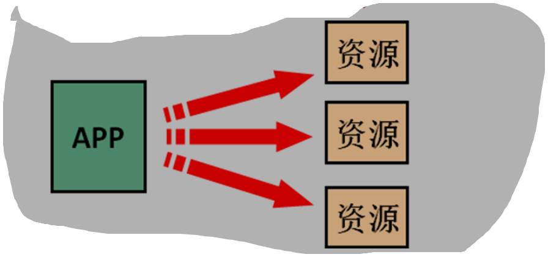
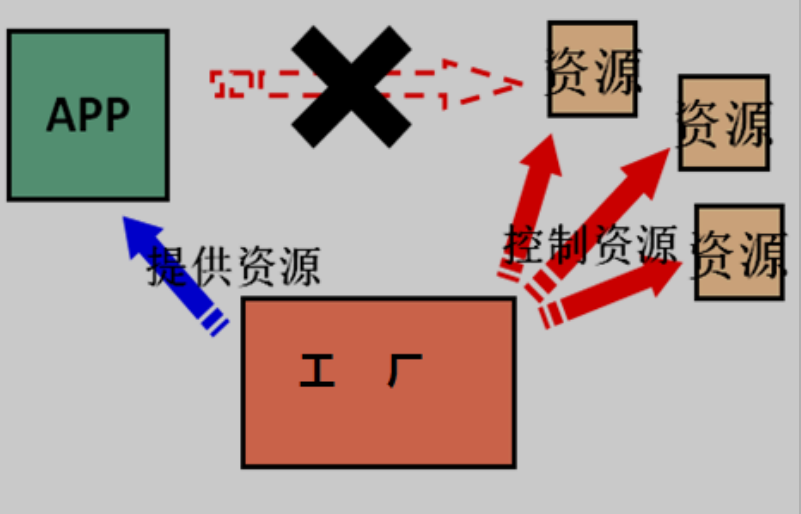
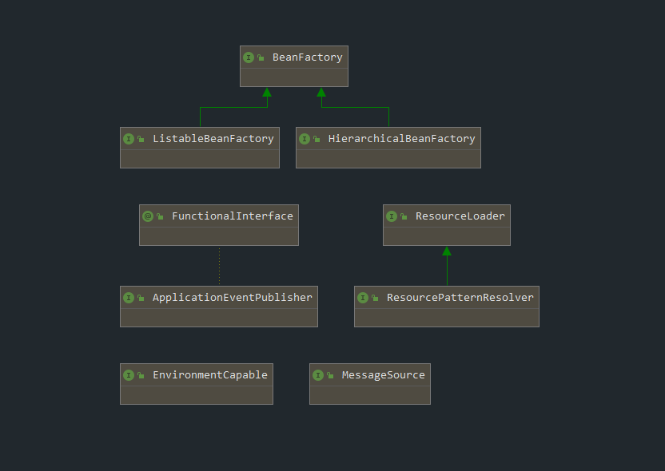
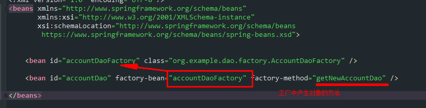
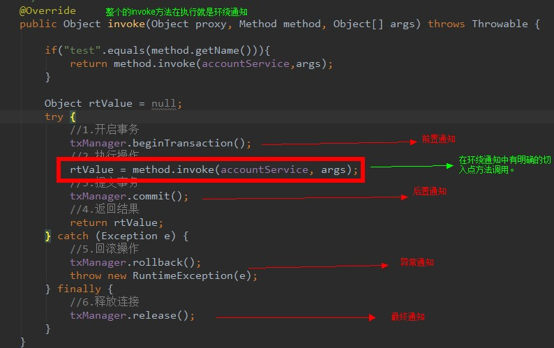
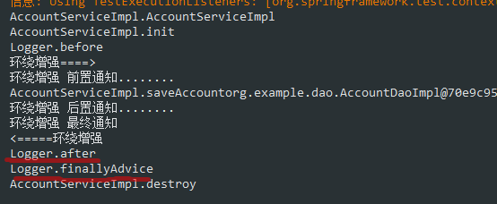
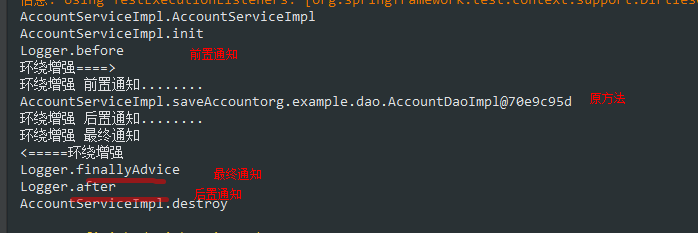

= Spring概述
:toc: left
:toc-title: Table of Contents
:toclevels: 4
:sectnums:
:sectnumlevels: 3
:sectanchors:
:sectlinks:
:partnums:

== Spring概述

=== Spring是什么

Spring 是分层的 Java SE/EE 应用 full-stack 轻量级开源框架，以 IoC（Inverse Of Control：反转控制）和 AOP（Aspect Oriented Programming：面向切面编程）为内核，提供了展现层 Spring MVC 和持久层 Spring JDBC 以及业务层事务管理等众多的企业级应用技术，还能整合开源世界众多著名的第三方框架和类库，逐渐成为使用最多的 Java EE 企业应用开源框架。

=== Spring 的发展历程

* 1997 年 IBM 提出了 EJB 的思想
* 1998 年，SUN 制定开发标准规范 EJB1.0
* 1999 年，EJB1.1 发布
* 2001 年，EJB2.0 发布
* 2003 年，EJB2.1 发布
* 2006 年，EJB3.0 发布 Rod Johnson（spring 之父）
* Expert One-to-One J2EE Design and Development(2002)阐述了 J2EE 使用 EJB 开发设计的优点及解决方案
* Expert One-to-One J2EE Development without EJB(2004)阐述了 J2EE 开发不使用 EJB 的解决方式（Spring 雏形）
* 2017 年 9 月份发布了 spring 的最新版本 spring 5.0 通用版（GA）

== IOC

控制反转 使用new创建对象时：

使用工厂创建对象：

为何叫做IOC控制反转，而不叫做工厂呢?因为我们使用new创建对象时，类拥有完全的控制权，可以随意创建具体的实现类，而当使用工厂模式时，类无法控制具体的创建对象，控制权被转移到了工厂

概念： 控制反转( Inversion of Contro,英文缩写为IoC)把创建对象的权利珓交给框架，是框架的重要特征,并非面冋对象编程的专用术语。它包括依赖注入( Dependency Injection,简称DI)和依赖查找( Dependency Lookup)。

作用：减少程序中的耦合（解除代码中的依赖关系）

=== Spring中的IOC

简单使用：

. bean配置文件

{source,xml]
----
<?xml version="1.0" encoding="UTF-8"?>
<beans xmlns="http://www.springframework.org/schema/beans"
  xmlns:xsi="http://www.w3.org/2001/XMLSchema-instance"
  xsi:schemaLocation="http://www.springframework.org/schema/beans
        https://www.springframework.org/schema/beans/spring-beans.xsd">

  <bean id="accountDao" class="org.example.dao.AccountDaoImpl"/>

  <bean id="accountService" class="org.example.service.AccountServiceImpl"/>
</beans>
----

. java测试代码

{source,java]
----
    @org.junit.Test
public void testSpringIoc(){
    ApplicationContext applicationContext=new ClassPathXmlApplicationContext("bean.xml");

    IAccountDao accountDao=applicationContext.getBean("accountDao",IAccountDao.class);
    System.out.println(accountDao.queryAccount());

    IAccountService accountService=applicationContext.getBean("accountService",IAccountService.class);
    accountService.saveAccount();
    }
----

ApplicationContext 有三个常用的实现类：

* ClassPathXmlApplicationContext: 可以读取类路径下的配置
* FileSystemApplicationContext: 可以读取任意路径下的配置（必须要有权限）
* AnnotationApplicationContext:读取注解配置

ApplicationContext 的类图：

ApplicationContext：立即加载，读取完配置文件时，即创建对应的对象

* 适用于单例模式 BeanFactory：延迟加载，当根据Id获取对象时才创建
* 适用于多例模式

=== 基于注解的IoC

* @Component
* @Controller：一般用于表现层
* @Service：一般用于业务层
* @Repository：一般用于持久层
* 以上四个作用及属性完全一样：把当前类对象存入spring容器之中，value属性指定id，单他们是spring提供用于三层架构的注解，使代码更加清晰

. 容器配置更改

{source,xml]
----
<?xml version="1.0" encoding="UTF-8"?>
<beans xmlns="http://www.springframework.org/schema/beans"
  xmlns:xsi="http://www.w3.org/2001/XMLSchema-instance"
  xmlns:context="http://www.springframework.org/schema/context"
  xsi:schemaLocation="http://www.springframework.org/schema/beans
        https://www.springframework.org/schema/beans/spring-beans.xsd
        http://www.springframework.org/schema/context
        https://www.springframework.org/schema/context/spring-context.xsd">

  <context:component-scan base-package="org.example.dao"/>
  <context:component-scan base-package="org.example.service"/>
</beans>
----

. 在需要spring管理的bean的类上方书写注解：

{source,java]
----

@Component("accountDao")
public class AccountDaoImpl implements IAccountDao {

}
----

自动注入数据``Autowired``:

{source,java]
----

@Service("accountService")
public class AccountServiceImpl implements IAccountService {

  @Autowired
  private IAccountDao accountDao;

  @Override
  public void saveAccount() {
    System.out.println("AccountServiceImpl.saveAccount" + accountDao);
  }
}
----

* 被Autowired注解的字段后，spring只要能在容易中查找到字段数据类型的唯一对象，即可注入成功
* 如果查找到多个同类型对象，则会根据字段名称以及多个同类型对象的注解ID查找，相同ID的即会被注入
* 否则失败并抛出异常
* @Component
* @Controller：一般用于表现层
* @Service：一般用于业务层
* @Repository：一般用于持久层
* @Autowired：自动注入，依据类型、字段名和bean对象ID进行匹配
* @Qualifier：根据类型及名称注入，但是不能单独在类成员上使用，需要配合@Autowired，方法参数可以
* @Resource：直接根据bean对象ID注入，可单独使用
* Autowired、Qualifie、Resource只能诸如其他bean，集合类型只能使用xml配置文件注入
* @Value：注入基本数据类型和String类型，可以使用SpELl(Spring EL表达式) ${}
* @Scope：作用域，Singleton、prototype

生命周期相关：

* PreDestory
* PostConstruct

== Bean

在计算机英语中 ``bean``有可重用组件的意思。 javabean并不等于实体类，javabean > 实体类，JavaBean时用Java语言编写的可重用组件。

=== spring中的JavaBean

管理细节

. 创建JavaBean的三种方式
. bean对象的作用范围
. bean对象的生命周期

==== 创建JavaBean的三种方式

. 仅有id、class属性，且类中拥有默认构造方法（否则无法创建对象）

{source,xml]
----

<bean id="accountDao" class="org.example.dao.AccountDaoImpl"/>
----

. 使用工厂方法或其他类方法创建对象并存入spring容器

. 使用静态方法创建

{source,xml]
----
<?xml version="1.0" encoding="UTF-8"?>
<beans xmlns="http://www.springframework.org/schema/beans"
  xmlns:xsi="http://www.w3.org/2001/XMLSchema-instance"
  xsi:schemaLocation="http://www.springframework.org/schema/beans
        https://www.springframework.org/schema/beans/spring-beans.xsd">
  <bean id="accountDao" class="org.example.dao.factory.AccountDaoFactory"
    factory-method="getNewAccountDao"/>
</beans>
----

==== Spring中的Bean的作用范围

指定范围可以使用 `scope` 属性 scope取值：

. singleton：单例（默认）
. prototype：多例
. request：作用于web应用的请求方法
. session：作用于web应用的会话方法
. global-session：作用于集群环境的会话范围，当不是集群环境时，它就是session

==== Spring中的Bean的生命周期

单例对象：

* 出生：读取完配置文件即出生
* 活着：程序未结束就一致或者
* 消亡：容器关闭即消亡
* 生命周期同容器相同

多利对象：

* 使用时出生
* 使用期间或者
* 垃圾回收时死亡

== 依赖注入

Dependenc Injection

将依赖关系交由Spring来管理，当前类需要用到的其他类对象由Spring为我们提供，我们只需要在配置文件中说明。

可以注入的三类数据：

. 基本类型、String
. 其他bean类型（在配置文件中或注解中配置过的bean）
. 复杂类型、集合类型

注入的方式：

. 使用构造函数提供
. 使用set方法提供
. 使用注解提供

=== 构造函数注入

简单的模拟：

. AccountDaoImpl构造函数需要参数，且无默认构造函数

{source,java]
----
    public AccountDaoImpl(Date date){
    System.out.println(date);
    }
----

. 在配置文件中使用``constructor-arg``标签指定参数

{source,xml]
----
<?xml version="1.0" encoding="UTF-8"?>
<beans xmlns="http://www.springframework.org/schema/beans"
  xmlns:xsi="http://www.w3.org/2001/XMLSchema-instance"
  xsi:schemaLocation="http://www.springframework.org/schema/beans
        https://www.springframework.org/schema/beans/spring-beans.xsd">
  <bean id="accountDao" class="org.example.dao.AccountDaoImpl">
    <constructor-arg name="date" ref="nowDate"/>
  </bean>
  <bean id="nowDate" class="java.util.Date"/>
</beans>
----

constructor-arg标签属性：

* type、name、index：都是用于查找参数，通常使用name即可
* ref：引用在Spring的IoC容器中出现过的bean对象
* value：给基本类型赋值

总结：改变了对象的实例化方式，创建对象时，即使我们用不到这些数据，也必须提供，因此实际开发中使用较少

=== Set方法提供

{source,xml]
----
<?xml version="1.0" encoding="UTF-8"?>
<beans xmlns="http://www.springframework.org/schema/beans"
  xmlns:xsi="http://www.w3.org/2001/XMLSchema-instance"
  xsi:schemaLocation="http://www.springframework.org/schema/beans
        https://www.springframework.org/schema/beans/spring-beans.xsd">
  <bean id="accountDao" class="org.example.dao.AccountDaoImpl">
    <property name="id" value="50"/>
    <property name="address" value="上海"/>
    <property name="birthday" ref="nowDate"/>
  </bean>
  <bean id="nowDate" class="java.util.Date"/>
</beans>
----

* property标签的name属性的值时set方法的名称（去掉set并将首字母小写后的名称）

总结

* 创建对象无明确限制
* 如果某个属性必须有值，则获取对象时可能没有hi下set方法

=== 复杂数据类型注入

{source,xml]
----
<?xml version="1.0" encoding="UTF-8"?>
<beans xmlns="http://www.springframework.org/schema/beans"
  xmlns:xsi="http://www.w3.org/2001/XMLSchema-instance"
  xsi:schemaLocation="http://www.springframework.org/schema/beans
        https://www.springframework.org/schema/beans/spring-beans.xsd">
  <bean id="accountDao" class="org.example.dao.AccountDaoImpl">
    <property name="id" value="50"/>
    <property name="address" value="上海"/>
    <property name="birthday" ref="nowDate"/>
    <property name="map">
      <map>
        <description>map description</description>
        <entry key="key1" value="value1"/>
        <entry key="key2" value="value2"/>
        <entry key="key3" value="value3"/>
      </map>
    </property>
    <property name="properties">
      <props>
        <prop key="properties">spring dj</prop>
      </props>
    </property>
  </bean>
  <bean id="nowDate" class="java.util.Date"/>
</beans>
----

== AOP

在软件业,AOP为 ``Aspect Oriented Programming``的縮写,意为:**面向切面编程**，通过预编译方式和运行期 *动态代理* 实现程序功能的统一维护的一种技术。AOP是OOP的延续,是软件开发中的一个热点,也是 Spring 框架中的一个重要内容,是函数式编程的一种衍生范型。利用AOP可以对业务逻辑的各个部进行隔离,从而使得业务逻辑各部分之间的耦合度降低,提高程序的可重用性,同时提高了开发的效率。

简单的说它就是把我们程序重复的代码抽取出来，在需要执行的时候，使用动态代理的技术，在 *不修改源码* 的基础上，对我们的已有方法进行增强。

作用：在程序运行期间，不修改源码对已有方法进行增强。 优势：

* 减少重复代码
* 提高开发效率
* 维护方便

实现方式：动态代理

动态代理：

. 基于接口的动态代理：JDK自带的Proxy，要求至少实现一个接口
. 基于子类的动态代理：第三方包CGLIB提供（如果报 asmxxxx 异常，需要导入 asm.jar），要求被代理类不能用 final 修饰的类（最终类）。

=== 相关术语

* Joinpoint(连接点) 所谓连接点是指那些被拦截到的点。在 spring 中,这些点指的是方法,因为 spring 只支持方法类型的连接点。

____
接口中的所有方法都是连接点
____

* Pointcut(切入点) 所谓切入点是指我们要对哪些 Joinpoint 进行拦截的定义。

____
增强方法中经过处理的方法都是切入点
____

* Advice(通知/增强): 所谓通知是指拦截到 Joinpoint 之后所要做的事情就是通知。通知的类型：前置通知,后置通知,异常通知,最终通知,环绕通知。 
* Introduction(引介): 引介是一种特殊的通知在不修改类代码的前提下, Introduction 可以在运行期为类动态地添加一些方法或 Field。
* Target(目标对象): 代理的目标对象。
* Weaving(织入): 是指把增强应用到目标对象来创建新的代理对象的过程。spring 采用动态代理织入，而 AspectJ 采用编译期织入和类装载期织入。
* Proxy（代理）: 一个类被 AOP 织入增强后，就产生一个结果代理类。
* Aspect(切面): 是切入点和通知（引介）的结合。

=== Spring中Aop配置及实现

. 相关依赖
+
{source,xml]
----
     <dependency>
         <groupId>org.springframework</groupId>
         <artifactId>spring-context</artifactId>
         <version>5.2.7.RELEASE</version>
     </dependency>

     <dependency>
         <groupId>org.aspectj</groupId>
         <artifactId>aspectjweaver</artifactId>
         <version>1.8.7</version>
     </dependency>
----

. aop相关配置

{source,xml]
----
<?xml version="1.0" encoding="UTF-8"?>
<beans xmlns="http://www.springframework.org/schema/beans"
  xmlns:xsi="http://www.w3.org/2001/XMLSchema-instance"
  xmlns:aop="http://www.springframework.org/schema/aop"
  xmlns:context="http://www.springframework.org/schema/context"
  xsi:schemaLocation="http://www.springframework.org/schema/beans
        https://www.springframework.org/schema/beans/spring-beans.xsd
        http://www.springframework.org/schema/context
        https://www.springframework.org/schema/context/spring-context.xsd
        http://www.springframework.org/schema/aop
        https://www.springframework.org/schema/aop/spring-aop.xsd">

  <context:component-scan base-package="org.example.service"/>

  <bean id="accountService" class="org.example.service.AccountServiceImpl"/>
  <bean id="accountDao" class="org.example.dao.AccountDaoImpl"/>
  <bean id="queryRunner" class="org.apache.commons.dbutils.QueryRunner"/>
  <bean id="dataSource" class="org.apache.commons.dbcp2.BasicDataSourceFactory"
    factory-method="createDataSource">
    <constructor-arg>
      <props>
        <prop key="driverClassname">com.mysql.cj.jdbc.Driver</prop>
        <prop key="url">jdbc:mysql://localhost:3306/test_db</prop>
        <prop key="username">root</prop>
        <prop key="password">123</prop>
      </props>
    </constructor-arg>
  </bean>

  <bean id="logger" class="org.example.log.Logger"/>

  <aop:config>
    <!--   配置切面     -->
    <aop:aspect ref="logger">
      <aop:before method="debug"
        pointcut="execution( public void org.example.service.AccountServiceImpl.saveAccount())"/>
    </aop:aspect>
  </aop:config>
</beans>
----

切入点表达式写法

. 访问修饰符可以省略
. 返回值可以使用通配符，表示任意返回值
. 包名可以使用通配符 *
 ** 几级包，就需要几个*： `*.*.*`
 ** ..
表示当前包及其子包
 ** 类名、方法名可以使用 * 通配
. 参数列表
 ** 基本数据类型可以直接写名称
 ** 引用类型写 _包名.类名的方式_
 ** 可以使用通配符 *，但是必须要有参数
 ** 使用..
有无参数都可以匹配，有参数匹配任意类型
. 全通配符写法：`* *..*.*(..)`
. 几种通知类型

{source,xml]
----

<aop:config>
  <aop:pointcut id="savePointCut"
    expression="execution(* org.example.service.AccountServiceImpl.saveAccount())"/>

  <!--   配置切面     -->
  <aop:aspect ref="logger">
    <aop:before method="before" pointcut-ref="savePointCut"/>

    <aop:after method="after" pointcut-ref="savePointCut"/>

    <aop:around method="around" pointcut-ref="savePointCut"/>
  </aop:aspect>
</aop:config>
----

. 环绕通知方法

{source,Java]
----
    public void around(ProceedingJoinPoint joinPoint){
    System.out.println("环绕增强====>");
    try{
    System.out.println("环绕增强 前置通知........");
    joinPoint.proceed();
    System.out.println("环绕增强 后置通知........");

    }catch(Throwable throwable){
    System.out.println("环绕增强 异常通知: "+throwable);
    }finally{
    System.out.println("环绕增强 最终通知");
    System.out.println("<=====环绕增强");
    }
    }
----

. 运行结果 正常运行结果：普通通知\->环绕通知\->普通通知 

=== Spring中AOP通知顺序BUG

实际上，我目前并不确定这是否是一个BUG，因为我才开始学 Spring。

问题是这样的，前一张图是正常情况下的运行顺序，在某些情况下，会发生 *最终通知=\=>后置通知* 的顺序，例如：

经过我都百度和测试，我发现这和XML文件的aop的通知配置顺序有关系，下面是正常通知顺序的配置：

{source,xml]
----

<aop:config>
  <aop:pointcut id="savePointCut"
    expression="execution(* org.example.service.AccountServiceImpl.saveAccount())"/>
  <!--   配置切面     -->
  <aop:aspect ref="logger">
    <aop:before method="before" pointcut-ref="savePointCut"/>
    <aop:around method="around" pointcut-ref="savePointCut"/>
    <aop:after-returning method="after" pointcut-ref="savePointCut"/>
    <aop:after-throwing method="catchException" pointcut-ref="savePointCut"/>
    <aop:after method="finallyAdvice" pointcut-ref="savePointCut"/>
  </aop:aspect>
</aop:config>
----

如果打乱此XML配置顺序，会出现好几种无法预料的通知顺序，目前无法解释。

=== Spring AOP的注解配置

. 添加扫描路径
. 开启aop
+
{source,xml]
----
<aop:aspectj-autoproxy />
----

. 配置切入点表达式
+
{source,java]
----
@Pointcut("execution(* org.example.service.AccountServiceImpl.saveAccount())")
private void exeSaveAccount() {

}
----

. 配置通知、引用表达式：
+
{source,java]
----
@Before("exeSaveAccount()")
public void before() {
    System.out.println("Logger.before");
}

@AfterReturning("exeSaveAccount()")
public void after() {
    System.out.println("Logger.after");
}
----
+
注解中的值是切入点表达式注解配置所在的方法名(必须带括号)

== JdbcTemplate

=== 简单应用

{source,java]
----
@Test
public void testJdbc(){
    // Spring的内置数据源
    DriverManagerDataSource driverManagerDataSource=new DriverManagerDataSource();

    driverManagerDataSource.setDriverClassName("com.mysql.cj.jdbc.Driver");
    driverManagerDataSource.setUrl("jdbc:mysql://localhost:3306/test_db");
    driverManagerDataSource.setUsername("root");
    driverManagerDataSource.setPassword("123");

    JdbcTemplate templateTest=new JdbcTemplate(driverManagerDataSource);

    templateTest.update("insert into account(id, uid, money) values(3, 41, 1000000) ");
    }
----

== Spring的事务管理

=== 事务传播行为

首先，Spring定义了七种事务传播行为，它们分别是：

|===
| 事务传播行为类型 | 说明

| PROPAGATION_REQUIRED
| 如果当前没有事务，就新建一个事务，如果已经存在一个事务中，加入到这个事务中。这是最常见的选择。

| PROPAGATION_SUPPORTS
| 支持当前事务，如果当前没有事务，就以非事务方式执行。

| PROPAGATION_MANDATORY
| 使用当前的事务，如果当前没有事务，就抛出异常。

| PROPAGATION_REQUIRES_NEW
| 新建事务，如果当前存在事务，把当前事务挂起。

| PROPAGATION_NOT_SUPPORTED
| 以非事务方式执行操作，如果当前存在事务，就把当前事务挂起。

| PROPAGATION_NEVER
| 以非事务方式执行，如果当前存在事务，则抛出异常。

| PROPAGATION_NESTED
| 如果当前存在事务，则在嵌套事务内执行。如果当前没有事务，则执行与PROPAGATION_REQUIRED类似的操作。
|===

事务传播行为用来描述由某一个事务传播行为修饰的方法被嵌套进另一个方法的时事务如何传播。

用伪代码说明：

{source,java]
----
 public void methodA(){
    methodB();
    //doSomething
    }

@Transaction(Propagation = XXX)
public void methodB(){
    //doSomething
    }
----

代码中methodA()方法嵌套调用了methodB()方法，methodB()的事务传播行为由@Transaction(Propagation=XXX)设置决定。这里需要注意的是methodA() 并没有开启事务，某一个事务传播行为修饰的方法并不是必须要在开启事务的外围方法中调用。

https://segmentfault.com/a/1190000013341344[具体参考此博客]，详细的演示并说明了每种行为。

* 事务传播行为只有在不同的``JdbcTemplate``,之间有效。因为外围测试方法使用同一个JdbcTemplete提交会导致测试没有意义。这也代表需要使用不同的业务层类进行模拟测试
* REQUIRED：内部事务或外部事务异常都会导致回滚（捕捉异常也会回滚）
* NESTED：基本同``REQUIRED``相同，但内部事务异常可捕捉（单独回滚）
* REQUIRES_NEW：永远不会互相影响，内部外部、内部之间都不会互相影响
* MANDATORY：外围方法无事务将抛出异常
+
{source,java]
----
IllegalTransactionStateException: No existing transaction found for transaction marked with propagation 'mandatory'
----
+
只回滚 标记为 mandatory 事务的方法。

* NEVER：外围方法存在事务时抛出异常：
+
{source,text]
----
IllegalTransactionStateException: Existing transaction found for transaction marked with propagation 'never'
----

* 省略其他...

=== 基于XML的事务管理

{source,xml]
----
<?xml version="1.0" encoding="UTF-8"?>
<beans xmlns="http://www.springframework.org/schema/beans"
  xmlns:xsi="http://www.w3.org/2001/XMLSchema-instance"
  xmlns:aop="http://www.springframework.org/schema/aop"
  xmlns:tx="http://www.springframework.org/schema/tx"
  xsi:schemaLocation="
        http://www.springframework.org/schema/beans
        http://www.springframework.org/schema/beans/spring-beans.xsd
        http://www.springframework.org/schema/tx
        http://www.springframework.org/schema/tx/spring-tx.xsd
        http://www.springframework.org/schema/aop
        http://www.springframework.org/schema/aop/spring-aop.xsd">

  <!--  配置Spring事务管理器  -->
  <bean id="transactionManager"
    class="org.springframework.jdbc.datasource.DataSourceTransactionManager">
    <property name="dataSource" ref="datasource"/>
  </bean>
  <!--  配置事务的通知  -->
  <tx:advice id="txAdvice" transaction-manager="transactionManager">
    <tx:attributes>
      <!-- 所有更新方法 -->
      <tx:method name="*" propagation="REQUIRED" read-only="false"/>

      <!-- 所有查询方法  -->
      <tx:method name="find*" propagation="SUPPORTS" read-only="true"/>
      <tx:method name="query*" propagation="SUPPORTS" read-only="true"/>
    </tx:attributes>
  </tx:advice>

  <aop:config>
    <aop:pointcut id="pointCut1"
      expression="execution(* org.example.service.AccountServiceImpl.*(..))"/>
    <!-- 建立切入点表达式和事务通知的对应关系 -->
    <aop:advisor advice-ref="txAdvice" pointcut-ref="pointCut1"/>
  </aop:config>
</beans>
----

=== 基础注解的事务管理

纯注解配置下的事务管理除了配置事务传播行为麻烦一点以外，都还挺简单的。大概像这样：

{source,java]
----
@Transactional(rollbackFor = Exception.class)
public void testTransaction(){
    accountService.updateAccount1();

    accountService2.updateAccount2();
    }
----

== 纯注解配置下的Spring

. @Configuration：写于类上方，指定此类作为Spring的配置类，进行注解读取
. @ComponentScan：告知Spring注解扫描区域（包）
. @Bean：用于方法，指示方法生成的对象交由Spring管理
 ** 如果方法中带有参数，则会按照``@Autowired``的方式寻找参数
 ** 即首先，唯一类型匹配?字段名字匹配?
. @Autowired：As of Spring Framework 4.3, an @Autowired annotation on such a constructor is no longer necessary if the target bean defines only one constructor to begin with.
从4.3开始，如果目标bean只有一个带参构造函数，则无需使用此注解；单存在多个构造函数，且没有默认构造函数时，必须提供至少一个此注解
. @import：导入其他配置类中的配置

* 总结：纯注解配置实际上并没有带来便利，实际上变得更加麻烦了，并且配置变得太过于分散，不好控制，但如何使用，是视情况而定的

=== Spring整合Junit测试

{source,java]
----

@RunWith(SpringJUnit4ClassRunner.class)
@ContextConfiguration(classes = SpringConfig.class)
public class BeanFactoryTest {

  @Autowired
  private IAccountService accountService;

  @Test
  public void testQueryById() {
    System.out.println(accountService.queryById(1));
  }

  @Test
  public void testDeleteOne() {
    accountService.deleteAccountById(3);
  }
}
----

* Junit的版本必须高于4.12
* 使用@RunWith（Junit提供）注解：`@RunWith(SpringJUnit4ClassRunner.class)` * 使用@ContextConfiguration（Spring）注解：指定配置类或配置文件``@ContextConfiguration(classes = SpringConfig.class)``
* 然后即可使用自动注入@Autowired，
