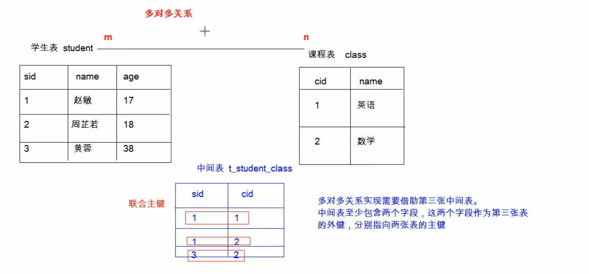
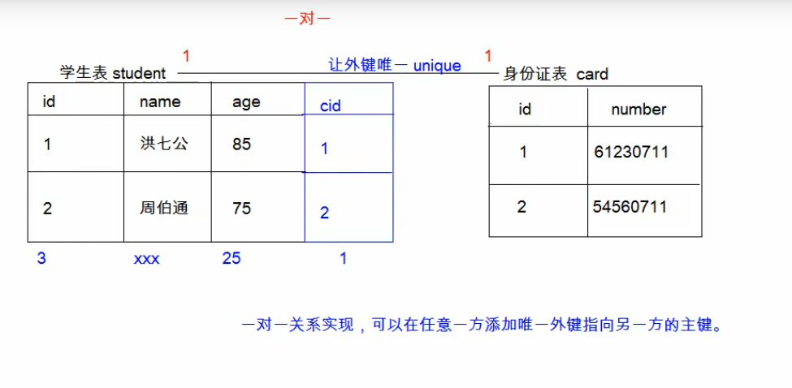
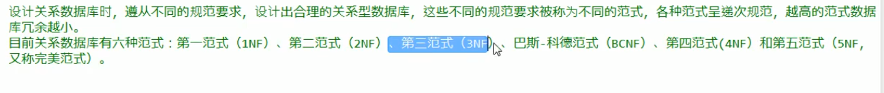
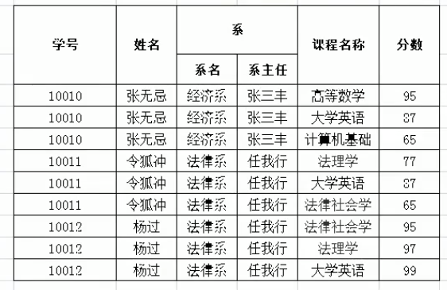
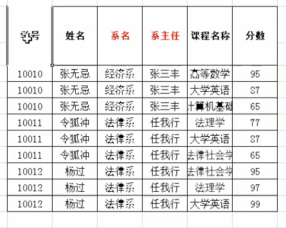
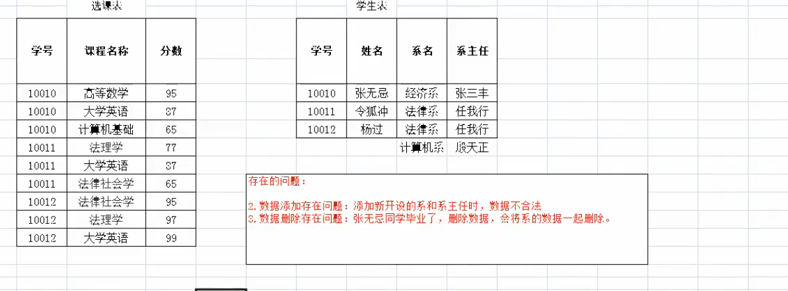
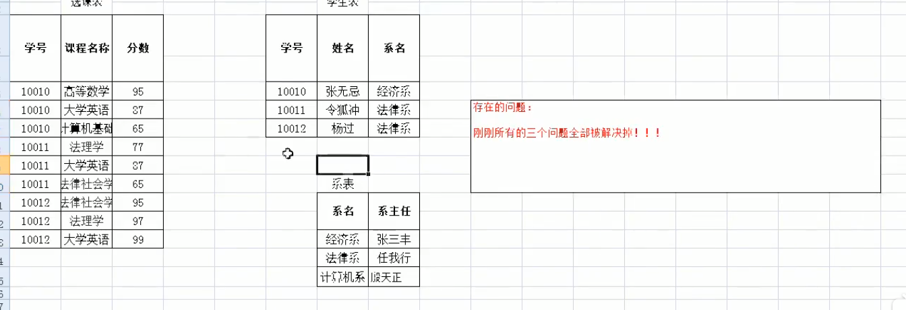

# 数据库


特点：

1. 持久化的存储
2. 方便管理、存储数据
3. 使用了统一的方式操作数据库

## MySQL

* 卸载


  1. 在MySQL安装目录找到my.ini文件
  2. 复制``datadir``的值
  3. 卸载MySQL并删除``datadir``文件夹

* 打开、关闭MySQL服务

  ```cmd
  net start mysql
  net stop mysql
  ```

* 登录

  1. mysql -uroot -p
  2. mysql -h【ip】 -uroot -p

* 退出

  1. quit
  2. exit

* 概念

  1. 数据库：文件夹
  2. 表：文件
  3. 数据：文件内容

### WorkBench

* 导入sql脚本：file->open sql scrpit;

# SQL

> Structured Query Language

1. 定义了关系型数据库的操作规则
2. 可以单行、多行、分号结尾
3. 空格、制表符不影响语句
4. 不区分大小写
5. 注释：
   1. -- 注释内容
   2. \# 注释内容
   3. /\* 注释内容 \*/


## 分类

1. DDL（Database Definition Language）：数据库定义语言，定义数据库对象：数据库、表、列等（``create、drop、alter``）
2. DML（Database Manipulation Language）：数据库操作语言（insert、delete、update）
3. DQL（Database Query Language）：SELECT WHERE
4. DCL（Database Control Language）：定义数据库的访问权限、安全级别（GRANT、REVOKE）

## 数据类型


## 工具

* SQLYOG

## DDL

CRUD（CREATE、Retrieve、UPDATE、DELETE）

### 操作数据库
* 查询
```sql
show databases;
show create databases mysql;
```

* 创建
```SQL
create database if not exists db3;
create database db3 character set gbk;
create database if not exists db3 character set gbk;
```

* 更改
```sql
alter database 数据库名称 character set ...;
```

* 删除
```SQL
drop database 数据库名称;
drop database if not exists 数据库名称;
```

* 使用
```SQL
-- 查询当前正常使用的数据库的名称
select database();
use database;
```

### 操作表
1. 创建
```sql
CREATE table tableName (
  column1 dataType1,
  column2 dataType2,
  column3 dataType3;
) ;
-- 创建一个和student相同结构的表
create table stu like student;
```
**最后一行不加逗号**

2. 查询
``show tables;``

3. 删除

   ``drop table if not exists 表名;``

4. 修改

   ```sql
   alter table 表名 rename to newName;
   alter table 表名 character set utf8;
   -- 添加一列
   alter table 表名 add 列名 数据类型;
   -- 修改列
   alter table 表名 change 列名 新列名 新的数据类型;
   alter table 表名 modify 列名 新的数据类型;
   -- 删除列
   alter table 表名 drop 列名;
   ```


## DML：增删改

1. 插入

   ``insert into stu(id,name) values(1, 'zs');``

   * 列名于值必须一一对应
   * 省略列名默认给所有列插入值

2. 删除

   ``delete from table  where 条件``

   * 如果不见条件，则删除所有数据（但会执行和数据条数一样多次数的删除操作，不推荐）

   * ``truncate table 表名``删除并创建一个一摸一样的空表（先删除表，推荐）

3. 修改

   ``update 表名 set 列=值 where 条件``

   * 不加条件时会修改所有数据

## DQL ：查询

**分类**

1. 排序查询
2. 聚合函数
3. 分组查询
4. 分页查询

* ``select * from student;``

### 语法

1. select：字段列表
2. from：表列表
3. where：条件
4. group by：分组
5. having：分组之后的条件
6. order by：排序
7. limit：分页限定

* distinct 去除重复的结果集（完全一样）
* select id,age,id + age from student;
* select id,age,id + age AS R from student;（别名）

### 排序查询

```sql
order by 列1 排序方式, 列2 排序方式;
```

**排序方式**：ASC（升序）、DESC（降序）

**示例**

```sql
select * from student order by math asc;
select * from student order by math desc;

-- 按照数学成绩排序，如果一样，按照英语成绩排序
select * from student order by math asc, english desc;
```

* 多个排序条件时，只有当前面的条件一样时，才会使用后面的排序/。

### 聚合函数

> 将一列作为整体，进行纵向的计算
>
> 所有聚合函数都会排除null，可使用``IFNULL``避免，或选择非空列计算（主键）

1. count

   ```sql
   select count(name) from student;
   select count(IFNULL(age, 20)) from student;
   ```


2. max:``select max(name) from student;``

3. min

4. avg

5. sum

* IFNULL

### 分组查询

```sql
select age, count(age) from student group by age;
```

* 分组之后的查询列只写分组条件或聚合函数，不要写其他字段，即使不报错，结果也没有任何意义


* 添加分组条件

  ```sql
  select age, count(age) from student where age > 20 group by age;
  ```

* where与having的区别

  1. where在分组之前限定，不满足时不参与分组
  2. having在分组之后限定，不满足时不会被查询出来

  

  ​	(上图是查询后数量结果需要大于1的才显示)

  3. where后不可以跟聚合函数

  * 别名：

    `` select age, count(age) p from student group by age having p>1;``

### 分页查询

* limit：``limit 开始索引, 结束索引``

```sql
select * from student limit (页数-1) * 数据量，页数* 数据量
```

### 条件查询

* \>、<、>=..
* ``AND、BETWEEN AND、OR、IN、IS NULL、IS NOT NULL、LIKE``
* LIKE:模糊查询
  * \_:单个任意字符
  * %:多个任意字符

## 约束

> 对表中的数据进行限定，从而保证数据的完整性、正确性和有效性

类别：

1. 主键约束：primary key
2. 非空约束： not  null
3. 唯一约束：unique
4. 外键约束：foreign key

###  非空约束

```sql
alter table student modify age int(10) not null;
-- 删除约束
alter table student modify age int(10);
```

###  唯一约束

UNIQUE：可以有多个NULL

​		* 删除唯一约束

```sql
alter table stu drop index name;
```


### 主键约束（primary key）

> 非空且唯一，每张表只能用一个主键，主键时表中数据的唯一标识

**删除主键约束**

``alter table stu drop primary key;``

**添加主键约束**

``alter table stu modify id int primary key;``

* 如果表中已有重复的列数据，则会报错

### 自动增长

某一列如果是``auto_increment``可以达到值的自动增长

```sql
alter table student modify id int(11) unsigned auto_increment;-- 不会修改到primary key属性
-- 删除
alter table student modify id int(11) unsigned;
```

* 自动增长只和表中的上一条数据有关

### 外键约束

```sql
CREATE table employee {
  ...
  constraint emp_dept_fk foreign key (dep_id) references department(id)
}
```


* 删除外键

  ```sql
  alter table 表名 drop foreign key 外键名称;
  ```

* 添加外键

  ```sql
  alter table 表名 add constraint 外键名称 foreign key (外键字段名称) references 主表名称(主表列名称);
  ```

## 级联操作
 1. 级联更新
 ```SQL
  alter table 表名 add constraint 外键名称 foreign key (外键字段名称) references 主表名称(主表列名称)
  on UPDATE CASCADE;
 ```
 2. 级联删除
 ```SQL
  alter table 表名 add constraint 外键名称 foreign key (外键字段名称) references 主表名称(主表列名称)
  on delete CASCADE;
 ```
* 可以同时书写

## 数据库的设计

### 多表之间的关系
1. 1对1（人和身份证）
2. 一对多、多对一：部门与员工(员工表添加外键，指向部门表的主键)
3. 多对多：学生与课程







## 范式

> 设计数据库时需要遵循的一些规范，高范式必须先遵循低范式




* 不符合第一范式

1. 第一范式
> 所谓第一范式（1NF）是指数据库表的每一列都是不可分割的基本数据项，同一列中不能有多个值，即实体中的某个属性不能有多个值或者不能有重复的属性。如果出现重复的属性，就可能需要定义一个新的实体，新的实体由重复的属性构成，新实体与原实体之间为一对多关系。在第一范式（1NF）中表的每一行只包含一个实例的信息。

拆开系列



  **问题**
  * 数据冗余严重
  * 数据添加存在问题
  * 数据删除存在问题：删除同学会连 **系** 信息一起删除

2. 第二范式
> 第二范式（2NF）是在第一范式（1NF）的基础上建立起来的，即满足第二范式（2NF）必须先满足第一范式（1NF）。第二范式（2NF）要求数据库表中的每个实例或行必须可以被唯一地区分。为实现区分通常需要为表加上一个列，以存储各个实例的唯一标识。这个唯一属性列被称为主关键字或主键、主码。

**函数依赖**：通过A可以唯一确定B的属性值
  * 学号-》姓名
  * (学号，课程)->分数

**完全函数依赖**：A->B，如果A是一个属性组，则B的属性值需要依赖于A中的所有属性的属性值
  * 学号，课程->分数

**部分函数依赖**：A->B，如果A是一个属性组，则B的属性值只需要依赖于A中的部分属性的属性值
  * 学号，课程->姓名

**传递函数依赖**：A->B, B->C，通过A可以确定B，再通过B可以确定C，就称为 桓帝函数依赖
  * 学号->系，系->系主任

**码**：如果在一张表中，一个属性或属性组被其他所有的属性完全的依赖，就称这个属性为此表的码
  * （学号，课程名称）

**主属性**：码属性组中的所有属性
**非主属性**：除开主属性的所有属性



**问题**
* 数据添加存在问题
* 数据删除存在问题：删除同学会连 **系** 信息一起删除

3. 第三范式
> 满足第三范式（3NF） 必须先满足第二范式（2NF）。简而言之，第三范式（3NF）要求一个数据库表中不包含已在其它表中已包含的非主关键字信息。(**消除传递依赖**)



**问题**
* 已不存在问题

## 数据库的备份、还原
1. 备份
```shell
mysqldump -u用户名 -p密码 数据库名称 > 保存的路径
```
2. 还原
```SQL
-- 在数据库中操作
source D://a.sql
```

## 多表查询


```sql
select * from stu,user;
```

查询结果被称为**笛卡尔积**，但查询结果中包含了虚度破无用（错误）结果

笛卡尔积：两个集合的所有组成情况

因此需要消除所有无用结果

### 分类

1. 内连接查询
2. 外连接查询
3. 子查询

### 内连接查询

1. 隐式内连接

   ```sql
   select * from emp,dept where emp.'dept_id' = dept.'id';
   select emp.name,emp.gender,dept.name from emp,dept where emp.'dept_id' = dept.'id';

   select
   	t1.name,
   	t1.gender,
   	t2.name
   from
   	emp t1,
   	dept t2
   where
   	t1.'dept_id' = t2.'id';
   ```

2. 显示内连接

   语法：``select 字段 from 表名1 [inner] join 表名2 on 条件;``

   步骤

* 表
* 条件
* 字段

### 外连接查询

1. 左外连接

   语法：

   ```sql
   select 字段列表 from 表1 left [outer] join 表2 on 条件;
   ```

   例子：

   ```sql
   select t1.*, t2.'name' from emp t1 left join dept t2 on t1.'dept_id' = t2.'id';
   ```

   

   * 因此，左外连接查询的是左表的所有数据以及其交集

2. 右外连接

   语法：

   ```sql
   select 字段列表 from 表1 right [outer] join 表2 on 条件;
   ```

   * 因此，左外连接查询的是左表的所有数据以及其交集

### 子查询

> 查询中嵌套查询


* 子查询的不同情况

  1. 结果是单行单列：子查询可以作为条件，使用运算符判断。

  2. 结果是多行单列：子查询可以作为条件，使用``IN``判断。

     ```sql
     select  * from emp where dept_id in (
     	select id from dept where name = '帐务部' or name = '市场部'
     );
     ```


  3. 结果是多行多列：子查询可以作为虚拟表

     


## 查询示例

1. 分组查询


2. 左外连接查询示例


## 事务

1. 概念

   如果一个包含多个步骤的业务操作，被事务管理，要么同时成功，要么同时失败。

2. 操作

   * 开启事务：start transaction;
   * 回滚；rollback;
   * 提交：commit;

3. MySQL数据库中事务默认自动提交（DML语句会自动提交，手动提交需要开启事务）

   * 自动提交：MySQL默认自动提交（Oracle默认手动提交）

   * 手动提交：``start transaction;``开启事务

   * 修改事务默认提交方式：

     `` select @@autocommit;``结果为1代表自动，0代表手动

     ``set @@autocommit = 0;``

4. 事务的四大特征

   1. 原子性：不可分割的最小操作单位，要么同时成功，要么同时失败
   2. 持久性：提交后或回滚后，数据会发生持久化的保存
   3. 隔离性：多个事务之间，*相互独立*。
   4. 一致性：事务操作前后，数据总量不变

5. 事务的隔离级别

   * 多个事务之间相互隔离的， 相互独立的。但是多个事务操作同一批数据，则会引发一些问题，可以设置不同的隔离级别解决

   * 问题：

     1. 脏读：一个事务，读取到另一个事务没有提交的数据。
     2. 不可重复读（虚读）：在同一个事务中，两次读取到的数据不一样。
     3. 幻读：一个事务（DML）操作数据表中的所有记录，另一个事务添加了一条数据，则第一个事务查询不到自己的修改。

   * 隔离级别

     1. read uncommitted：读未提交。问题：脏读、虚读、幻读
     2. read committed：读已提交。问题：虚读、幻读
     3. repeatable read：可重复读。问题:幻读
     4. serializable：串行化。无问题

     * 隔离级别越高，性能越低。
     * 查询隔离级别：``select @@tx_isolation;``（MySQL默认为可重复读）
     * 设置隔离级别：``select global transaction isolation level 级别字符串``(下一次使用生效)

### JDBC管理事务

```java
setAutoCommit(fales);
commit();
rollback();
```


## DCL

> 管理用户、授权

### 管理用户

1. 查询用户

   ```sql
   use mysql;
   -- % 代表可在任意主机使用
   select * from user;
   ```

2. 创建用户

   ```sql
   create user '用户名'@'主机名' identified by '密码';
   ```

3. 删除用户

   ```sql
   drop user '用户名'@'主机名';
   ```

4. 修改密码

   ```sql
   update user set password = PASSWORD('新密码') where user = '用户名';
   set password for '用户名'@'主机名' = PASSWORD('新密码');
   ```

   **忘记mysql root密码时**

   * cmd: net stop mysql;
   * 使用无验证方式启动：``mysqld --skip-grant-tables;``
   * 打开新的cmd
   * 修改密码
   * 结束mysql服务
   * 开启mysql服务

### 管理权限

1. 查询权限

   ```sql
   show grants for '用户名'@'主机名';
   ```

2. 授予权限

   ```sql
   grant 权限列表 on 数据库.表 to '用户名'@'主机名';
   -- 所有权限
   grant ALL on *.* to '用户名'@'主机名';
   ```

3. 撤销权限

   ```sql
   revoke 权限列表 on 数据库.表 from '用户名'@'主机名';
   ```
